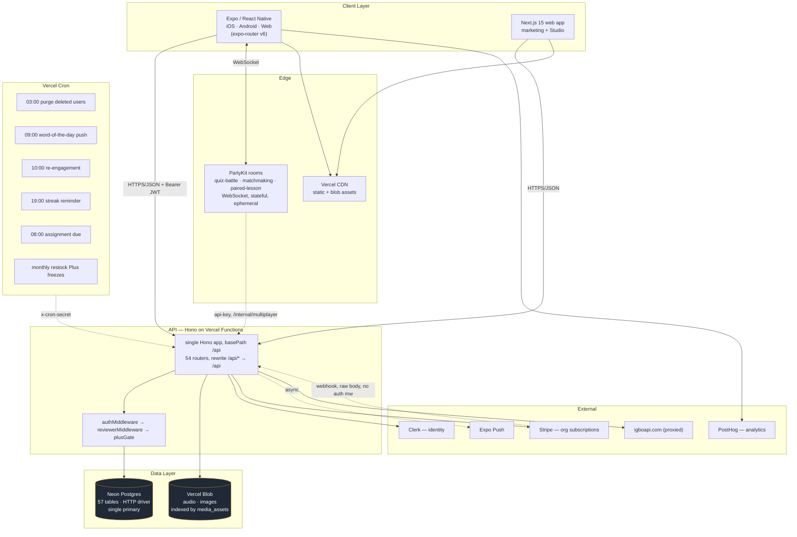

# Beeli — System Design

Written against the Standard Solution Template in `SystemDesign_StudyGuide.docx`
(sections 1–10, in order). Unlike the guide's case studies, this is not a
greenfield exercise: Beeli exists, so each section states **what is built today**
and then **what the design implies at 10×**. Where a number is an assumption
rather than a measurement, it is labelled `[ASSUMPTION]`.

Codebase snapshot: 54 API route modules (~23k LOC server), ~97k LOC mobile,
~53k LOC web, 57 Postgres tables, 45 explicit indexes.

---

## 1. Clarified Requirements

### Functional Requirements (in scope)

**Learner**
- A learner can browse published courses for a language and open a lesson (audio + transcript + culture notes).
- A learner can complete a lesson, which awards XP, advances a daily streak, and unlocks the next node on the journey map.
- A learner must pass a **checkpoint** (a generated round of questions over recently covered lessons) to unlock the next movement of a course.
- A learner can save a dictionary word to a personal word bank and review it on an SM-2 spaced-repetition schedule (`server/src/lib/sm2.ts`).
- A learner can search a language dictionary by word, English gloss, or category.
- A learner can write journal entries, optionally public, and see a community feed with likes and comments.
- A learner can play a real-time quiz battle against another learner (matchmaking or invite code).
- A learner can use the app **fully offline** for published content and have writes replay on reconnect.
- A **guest** (unauthenticated) can learn and accumulate progress locally, then migrate that progress into a real account on sign-up.

**Educator / Reviewer**
- A reviewer can author dictionary entries, sentences, proverbs, cultural content, lessons, and story arcs, scoped to the languages they are approved for.
- Authored content moves through `draft → in_review → published → archived` (`contentStatusEnum`).
- Every content mutation writes an immutable snapshot to `content_versions` and an actor-attributed row to `audit_log`.
- An educator can create a classroom group, add members, and assign lessons with due dates.

**Admin**
- An admin can publish/unpublish any content, run bulk CSV imports, manage languages, approve reviewer applications, and read platform stats.

**Billing / org**
- An organization can hold a Stripe subscription with a student seat limit; entitlement gates classroom size (`plus-gate.ts`, `billing.ts`).

### Non-Functional Requirements

| Property | Target | Status |
|---|---|---|
| Availability (read path) | 99.9% | Inherited from Vercel + Neon; no independent SLO measurement |
| Availability (write path) | 99.5% | Single-region Postgres, no failover story |
| Lesson/course read latency | P99 < 300 ms warm | Served from client cache in the common case, so effectively ~0 ms |
| Content snapshot fetch | P99 < 3 s | Grows linearly with published corpus — see §7 |
| Progress write ack | P99 < 500 ms | Optimistic UI; the write is enqueued, not awaited |
| Real-time quiz round-trip | P99 < 150 ms | PartyKit edge rooms |
| Durability | No completed lesson, checkpoint pass, or authored content lost | Enforced by unique indexes + idempotent replay |
| Consistency | Read-your-writes for the acting learner; eventual everywhere else | Optimistic local state + React Query invalidation |
| Offline | Cold launch with no network must still teach a lesson | Snapshot in AsyncStorage + persisted query cache |

**Consistency model, stated explicitly.** Beeli is **AP** for learner progress
and **CP-by-uniqueness** for the things that must not double-count. There is no
global linearizability requirement anywhere in the product — the closest thing is
Stripe seat entitlement, and that tolerates seconds of lag.

### Explicitly Out of Scope

- Multi-region active-active. Single primary, no read replicas.
- Full-text relevance ranking (dictionary search is `ILIKE` prefix matching).
- End-to-end encryption of journals.
- Live-replica content editing (retired; Studio is form-based CRUD).
- Payment processing beyond Stripe Checkout + webhook.
- ASR / pronunciation scoring.

---

## 2. Scale Estimation (Back-of-Envelope)

Beeli is pre-scale. The estimate below is the **design envelope**, not current traffic.

`[ASSUMPTION]` Year-1 target: 50,000 MAU, 10,000 DAU, 8 languages published,
Izon as the deep corpus (~5,000 dictionary entries, ~400 lessons).

**Request volume**
```
10,000 DAU × 1 session/day × ~25 API calls/session = 250,000 req/day
250,000 / 86,400 s                                 ≈ 3 RPS average
Peak factor 10× (evening study window)             ≈ 30 RPS peak
```
30 RPS is two orders of magnitude below what a single Neon compute handles.
**The system is not throughput-bound. It is payload-bound and cold-start-bound.**

**The dominant read: the offline snapshot**
```
Izon corpus today ≈ 5,000 dictionary + 400 lessons + sentences/proverbs/cultural
Serialized JSON                            ≈ 4–8 MB [ASSUMPTION]
10,000 DAU × 1 snapshot check/day          = 10,000 checks/day
Only re-downloaded when the content hash changes → maybe 1 real download/user/week
10,000 × 8 MB / 7                          ≈ 11 GB/day egress
```
At 10× corpus (50,000 entries) the snapshot approaches 50–80 MB — which is the
single most important scaling limit in the system. See §7 and §10.

**Write volume**
```
10,000 DAU × 3 lesson completions       = 30,000 progress writes/day  ≈ 0.35 W/s
10,000 DAU × 20 SRS reviews             = 200,000 word_progress upserts/day ≈ 2.3 W/s
Peak ~10×                                ≈ 30 writes/s
```
Well inside the ~5,000–10,000 TPS single-node Postgres ceiling from the guide's
scale anchors. **No sharding is justified, now or at 100× this.**

**Storage**
```
user_progress:   10k DAU × 3/day × 365 × ~100 B ≈ 1 GB/year
word_progress:   bounded by (users × words) — 50k × 5k worst case = 250M rows [upper bound, unrealistic]
                 realistic: 50k × 200 saved words = 10M rows ≈ 1 GB
media (Vercel Blob): 400 lessons × 8 MB audio ≈ 3.2 GB per language
content_versions: every edit snapshots the full row — unbounded growth, no retention policy
```
`content_versions` is the only table with no natural bound. At 1,000 edits/day ×
2 KB snapshots that is 730 MB/year — tolerable, but it needs a retention policy
before it stops being.

**Bandwidth**: lesson audio dominates. 8 MB/lesson × 30,000 lesson plays/day ≈
240 GB/day if uncached — which is why audio must be CDN-fronted and why offline
download is a cost lever, not just a UX feature.

---

## 3. High-Level Architecture



Diagram conventions used: solid arrows are synchronous request/response, dashed
arrows are asynchronous or server-to-server, every arrow is labelled with its
protocol. Redraw in Excalidraw for session use; this version is the
version-controllable source of truth.

**The shape in one sentence:** a single stateless Hono API in front of one
Postgres primary, with all latency-sensitive real-time work pushed out to
PartyKit edge rooms and all latency-sensitive read work pushed *into the client*
as a hash-versioned offline snapshot.

---

## 4. Core Component Deep Dives

### 4.1 Mobile client (Expo SDK 54, React Native, New Architecture)

**Responsibility.** Owns the entire learner experience, and — unusually — owns a
meaningful share of the *system's* correctness. It is not a thin view: it holds
the content snapshot, the offline write queue, and the guest progress store, each
of which is a durable replica of server state.

**Technology choice.** Expo + expo-router for one codebase across iOS/Android/web.
Rejected: bare React Native (loses EAS/OTA updates), Flutter (no path to the
existing web app's shared `@mobile/*` imports).

**Internal state.** Four persistence layers, which is the main source of
complexity:
1. React Query cache → AsyncStorage via `createAsyncStoragePersister` (`lib/api.ts`) — survives cold launch.
2. Content snapshot → AsyncStorage, keyed by content hash (`lib/content-snapshot.ts`).
3. Write queue → Zustand + AsyncStorage (`store/write-queue-store.ts`).
4. Guest progress → Zustand + AsyncStorage (`store/guest-progress-store.ts`), mirroring server streak/XP rules.

**Failure mode.** If the client's snapshot and the server's published content
diverge (e.g. a lesson is unpublished while a learner holds it offline), the
learner completes a lesson that no longer exists. The write still lands —
`user_progress.lesson_id` is a plain `varchar`, not a foreign key. That is a
deliberate trade (writes never fail on content churn) with a real cost
(orphaned progress rows; hence `db:cleanup-orphans`).

### 4.2 API (Hono on Vercel Functions)

**Responsibility.** All authorization, all persistence, all third-party fan-out.

**Technology choice.** Hono for a small, Web-standard-Request router that runs
unchanged on Node and edge runtimes. Rejected: Express (heavier, callback-shaped,
worse Vercel Function ergonomics), Next.js route handlers (would couple the API's
release cadence to the web app's).

**Internal state.** None. Every function invocation is cold-capable. This is what
makes the API trivially horizontally scalable — and what makes §4.3's driver
choice load-bearing.

**Failure mode.** Cold start on an idle route adds ~200–800 ms. Because the
mobile client renders from cache first, a cold start is usually invisible; it is
visible on first sign-in and on Studio saves.

**Authorization chain.** `authMiddleware` verifies the Clerk JWT, then does one
indexed `SELECT` on `users.clerk_id`, creating the row on first sight with
`onConflictDoUpdate` so two concurrent first requests can't race. `reviewerMiddleware`
narrows to approved languages. `plusGate` checks org entitlement. Cron endpoints
bypass the chain entirely and authenticate on a shared `x-cron-secret` header.

### 4.3 Neon Postgres via `drizzle-orm/neon-http`

**Responsibility.** Single source of truth for all 57 tables.

**Technology choice.** Neon's serverless HTTP driver, because Vercel Functions
cannot hold a connection pool — every invocation is a fresh process, and a TCP
pool per invocation would exhaust Postgres connections at trivial concurrency.
The HTTP driver sidesteps connection management completely.

**The cost of that choice, stated plainly.** `drizzle-orm/neon-http` **does not
implement transactions** — `session.js` throws `"No transactions support in
neon-http driver"`. Three call sites currently call `db.transaction()`
(`routes/users.ts:411`, `routes/educator/story-arcs.ts:440`,
`routes/educator/lessons.ts:713`) and will throw at runtime. See §10, item 1.

**How correctness is maintained without transactions.** Not by locks — by
**uniqueness**. Every operation that must count once has a unique index that
makes a double-write a no-op:

| Invariant | Enforcement |
|---|---|
| A lesson counts once per user | `user_progress_user_lesson_idx (user_id, lesson_id)` |
| A checkpoint passes once | `checkpoint_completions_user_cp_idx (user_id, checkpoint_id)` |
| A word has one SRS state | `word_progress_user_word_idx (user_id, word_id)` |
| No XP farming on word challenges | `wc_submissions_user_word_idx (user_id, word_id)` |
| One user row per Clerk identity | `users.clerk_id UNIQUE` |

This is the design's central idea and it is a good one: **idempotency is a schema
property, not an application property.** It is what makes the offline write queue
safe to replay blindly.

**Failure mode.** Neon primary unavailable → total write outage, and read outage
for anything not already cached client-side. The mobile app degrades to offline
mode and keeps teaching; the Studio stops entirely. There is no replica, no
failover, no read-only degraded mode.

### 4.4 PartyKit (real-time)

**Responsibility.** Three room types — `quiz-battle`, `matchmaking`,
`paired-lesson` — each an authoritative in-memory state machine
(`lobby → countdown → question → between_questions → results`).

**Technology choice.** Stateful edge rooms, because a stateless Vercel Function
cannot hold a WebSocket or a per-round timer. Rejected: Postgres-polled game
state (latency and write amplification), a dedicated Node service (ops cost for
one feature).

**Internal state.** Volatile: players, scores, timers, `answeredThisRound`. Durable
results are written back through `/internal/multiplayer` with API-key auth —
mounted *outside* `/multiplayer` specifically so the authenticated router's
`use("*")` wildcard can't shadow it (a bug the codebase already paid for once).

**Failure mode.** Room eviction mid-match loses the match. Acceptable — a lost
quiz battle is not a lost lesson — but it means match results are best-effort
while lesson progress is not, and the product should not blur those.

### 4.5 Supporting services

- **Clerk** — identity. Tokens cached in `expo-secure-store` (skipped on web). Beeli stores only `clerk_id`, name, email, avatar; a Clerk outage blocks sign-in but not offline learning.
- **Vercel Blob** — lesson audio and images, indexed in `media_assets` so the Studio media library can browse and reuse instead of re-uploading. The index insert is deliberately best-effort (`recordMediaAsset` swallows errors) so a library failure never fails the editor save.
- **Stripe** — org subscriptions. Webhook router mounted before CORS-sensitive auth so it can read the raw body.
- **Expo Push + email** — fired from cron endpoints; fan-out is unbatched.
- **PostHog** — product analytics, client-side only.

---

## 5. Data Model

57 tables in seven domains:

| Domain | Tables |
|---|---|
| Identity & org | `users`, `organizations`, `organization_subscriptions`, `app_config` |
| Content | `languages`, `courses`, `lessons`, `lesson_checks`, `transcript_segments`, `scenarios`, `sentence_templates`, `quiz_questions`, `scripts`, `script_characters` |
| Lexicon | `dictionary_entries`, `english_wordbank`, `proverbs`, `etymology_entries`, `word_bank`, `phrase_bank` |
| Culture & story | `cultural_content`, `cultural_key_terms`, `lesson_cultural_content`, `culture_items`, `story_arcs`, `story_arc_cast`, `story_chapters`, `activities` |
| Learner state | `user_progress`, `word_progress`, `checkpoint_completions`, `quiz_results`, `can_do_checks`, `daily_challenges`, `journal_entries` |
| Social & classroom | `feed_items`, `likes`, `comments`, `contributions`, `classroom_groups`, `classroom_members`, `classroom_assignments`, `game_sessions`, `game_session_players`, `matchmaking_queue` |
| Editorial | `content_versions`, `audit_log`, `media_assets`, `reviewer_applications`, `bounties`, `feedback` |

### The localized-text pattern

Every translatable field is stored as a **pair**: a `jsonb` map plus a flat
English projection.

```sql
word                 varchar(500) NOT NULL,   -- the Izon headword
english              varchar(500) NOT NULL,   -- derived en projection
translations         jsonb,                   -- { en, fr, pcm, ar, pt, ... }
example_translations jsonb
```

The flat column exists so `ORDER BY`, `ILIKE`, and index usage stay simple; the
map exists so adding a language is a data change, not a migration. Server helpers
(`lib/translations.ts`: `resolveMap` / `project` / `applyMap` / `hydrate`) keep
the two in sync; clients resolve with `localizePair(map, flat, lang)`. This
replaced per-language `*Fr` sidecar columns, which did not scale past two
languages.

### Keys and partitioning

- **Content IDs are human-authored `varchar(64)` slugs** (`izon-m1-l3`), not UUIDs — so seed scripts, CSV imports, and lesson references are stable and diffable across environments.
- **Learner-state IDs are `uuid` with `defaultRandom()`**.
- **`user_id` is the natural partition key** for every learner-state table, and every one of them is indexed on it. If sharding were ever needed, `user_id` is a clean split with no cross-shard joins on the hot paths.
- **No hot keys exist.** There is no celebrity-fanout problem: the feed is small, there is no follow graph at Twitter scale, and the highest-contention row is a single learner's own `users` row (streak/XP), written by exactly one client.

### Referential integrity choices

`lessons.course_id` is `RESTRICT`, not `CASCADE`, with an explicit comment: a
cascading course delete would take every lesson, transcript, and chapter beneath
it — the largest blast radius in the schema. Courses are retired via `is_active`,
never deleted. Conversely, learner-state tables cascade on user delete, because
account deletion must actually delete.

`user_progress.lesson_id` and `word_progress.word_id` are **deliberately not FKs**
so offline writes replay even against content that has since been unpublished.
This is the correct trade for an offline-first app and the reason orphan cleanup
is a maintenance job rather than a database guarantee.

### Indexing

45 explicit indexes. The pattern is consistent: a unique index for every
idempotency invariant (§4.3), plus a `(user_id, language_id)` composite for every
per-learner listing query.

**Gap:** dictionary search is `ILIKE '%term%'` with no `pg_trgm` GIN index, so it
is a sequential scan over `dictionary_entries`. At ~5,000 rows this is a few
milliseconds and entirely fine. At 100,000 rows it is not.

---

## 6. API Design

Five endpoints that carry the system.

### 6.1 `GET /api/content/snapshot?lang=izon` — the offline bundle

The single most important endpoint in the product.

```jsonc
// 200
{
  "version": "a1b2c3d4e5f6a7b8",   // sha1(payload)[0:16]
  "languageId": "izon",
  "dictionary": [...], "sentences": [...], "proverbs": [...],
  "cultural": [...], "scripts": [...], "interactiveStories": [...],
  "courses": [...], "lessons": [...]
}
```
Auth: none (published content only). Errors: `400` on missing/oversized `lang`.

Built from the shared `content-selectors`, so it cannot drift from what the live
read routes serve — a real design win. The client compares `version` and skips
the download when unchanged.

**The flaw:** the hash is computed *after* assembling the entire payload. The
server does the full multi-table read and full JSON serialization on **every**
poll, then usually throws it away. There is no `If-None-Match` / `304` path.
See §10.

### 6.2 `POST /api/progress/:lessonId/complete`

```jsonc
// 200
{ "pointsEarned": 50, "totalPoints": 1250, "streak": 7,
  "streakIncremented": true, "streakMilestone": 7,
  "freezeGranted": 1, "leveledUp": false }
```
Auth: Bearer. Idempotent via `user_progress_user_lesson_idx` — a replayed write
returns the same shape without double-awarding. Composes `updateStreak()` and
`awardXP()`.

### 6.3 `POST /api/checkpoints`

```jsonc
// request
{ "checkpointId": "izon-m1-cp", "languageId": "izon",
  "correct": 8, "total": 10, "waived": false }
```
Idempotent via `checkpoint_completions_user_cp_idx`. `waived: true` records a
pass granted because the covered lessons had too little vocabulary to build a
fair round — deliberately distinguishable from an earned pass so content gaps
show up in tuning data rather than silently stranding learners.

### 6.4 `POST /api/wordbank/:id/review`

```jsonc
{ "rating": "again" | "hard" | "good" | "easy" }
// → { "interval": 6, "easeFactor": 2.5, "nextReviewAt": "2026-08-01T..." }
```
Applies SM-2 (`applySM2`). `again` re-surfaces in 10 minutes rather than 1 day,
so a failed card returns within the same session.

### 6.5 `POST /api/multiplayer/sessions` + PartyKit WebSocket

REST call creates the `game_sessions` row and returns `partyRoomId` and
`inviteCode`; the client then opens a WebSocket to the PartyKit room. Results
flow back server-to-server via `POST /api/internal/multiplayer/*` with API-key
auth. Two protocols, one feature — justified because HTTP cannot hold the timers.

### Cross-cutting

- **Auth:** `Authorization: Bearer <clerk_jwt>` on everything except public content reads, the Stripe webhook, and `/health`.
- **Errors:** every route returns `{ "error": "message" }`; `HTTPException` messages are surfaced verbatim, everything else becomes a generic 500 with the detail logged.
- **Rate limits: none.** There is no rate limiter anywhere in the codebase. See §10.

---

## 7. Scalability & Performance

**What scales for free.** The API is stateless, so Vercel Functions scale
horizontally with zero work. The HTTP database driver means concurrency is not
bounded by a connection pool. PartyKit rooms are independent and shard naturally
by room ID.

**What does not scale, in priority order.**

1. **The snapshot is O(published corpus), not O(what the learner needs.)** Every learner downloads every published row for their language. This is elegant today and untenable at 50,000 dictionary entries. The fix is not a redesign — it is (a) `ETag` + `304`, so unchanged polls cost one HEAD-sized response; (b) cache the assembled payload + hash rather than rebuilding per request; (c) eventually split the snapshot per course so a learner on Movement 1 doesn't carry Movement 10.
2. **Dictionary search is a sequential scan.** `pg_trgm` + GIN on `dictionary_entries.word` and `.english` is a one-migration fix, needed around 50k rows.
3. **`content_versions` grows without bound.** Needs a retention policy (keep last N versions per entity, or age out beyond 90 days).
4. **Notification fan-out is unbatched.** The cron endpoints iterate users and send individually. At 10k users inside a single Vercel Function invocation this will hit the execution time limit before it hits any external rate limit.

**Caching, by layer.**

| Layer | What | Policy |
|---|---|---|
| Client memory | React Query | 5 min stale, 2 retries, `networkMode: "always"` |
| Client disk | Query cache → AsyncStorage | survives cold launch |
| Client disk | Content snapshot | invalidated by content hash |
| Edge | Vercel CDN | static assets + blob media |
| Server | *none* | no Redis, no in-process cache |

The deliberate absence of a server cache is correct at current scale — adding
Redis would add an availability dependency to buy latency the client already has.
It becomes wrong at the point where snapshot assembly cost dominates, which is
also roughly when item 1 above forces the issue.

**`networkMode: "always"` is a non-obvious and correct choice.** React Query's
default `"online"` mode refuses to call the query function while offline — but
Beeli's query functions *are* the offline path: they branch on `useIsOffline()`
and serve from the snapshot. With the default, offline queries would hang in a
permanent loading state.

**Read/write separation.** None today (single primary, no replicas). Justified:
at ~30 RPS peak the primary is idle. The read/write ratio is heavily read-dominant
and would make replicas easy to add when they're warranted.

**Sharding.** Not justified now or at 100× current scale. If ever needed:
`user_id` for learner state, `language_id` for content — both clean splits.

---

## 8. Reliability & Fault Tolerance

### Top three failure modes

**1. Neon primary unavailable.**
- *Blast radius:* all writes, all uncached reads, all of Studio.
- *Handling today:* mobile falls back to snapshot + write queue and keeps teaching. Web Studio fails outright.
- *Gap:* no replica, no failover, no read-only degraded mode. A multi-hour Neon incident is a multi-hour Studio outage.

**2. `db.transaction()` throws (`neon-http`).**
- *Blast radius:* the daily purge-deleted-users cron, story-arc saves, and lesson saves in the educator router.
- *Handling today:* none — the call throws before any statement runs. Because it throws *before* the first write, the failure is at least atomic-by-accident: nothing partially applies. But the operation never succeeds.
- *This is a live defect, not a design trade.* See §10, item 1.

**3. Snapshot / published-content divergence.**
- *Blast radius:* a learner holding an unpublished lesson offline completes it; the write lands against a `lesson_id` with no row.
- *Handling today:* accepted by design (no FK), cleaned up by `db:cleanup-orphans`.
- *Assessment:* correct trade. The alternative — rejecting the write — punishes the learner for an editorial action they couldn't see.

### Idempotency

Every offline-replayable write is idempotent **at the schema layer**, not the
application layer (see the table in §4.3). `replayQueue()` therefore replays
blindly, oldest-first, stopping on the first failure and preserving order —
it never reorders, never drops, and never needs to reason about whether a write
already landed. This is the strongest single property in the design.

### Retries, timeouts, circuit breakers

- React Query: 2 retries with backoff on reads.
- Write queue: retries indefinitely on every reconnect, in order.
- **No circuit breakers anywhere.** No timeout on outbound calls to Clerk, Stripe, Expo Push, or igboapi. A hung igboapi proxy call holds a Vercel Function until the platform timeout.

### Consistency model — CAP / PACELC

**PA/EL.** Under partition, Beeli chooses availability: the client serves stale
snapshot content and queues writes. In normal operation it chooses latency:
optimistic local mutation, server reconciliation after. The uniqueness
constraints are what make that safe — the system is eventually consistent but
never *incorrectly* consistent, because a converged double-write collapses to one
row.

The one place this reasoning needs care is **guest → account migration**
(`lib/guest-migration.ts`): local guest progress is replayed against the server
after sign-up, and the guest store deliberately mirrors the server's streak and
freeze rules so the replay produces the same result the server would have.
Duplication of business logic across the boundary is the cost; identical
post-migration state is the benefit.

### Authorization boundaries

Three cron endpoints and one PartyKit callback authenticate on **shared secrets
in headers** (`x-cron-secret`, API key), not JWTs. That is standard for
machine-to-machine calls, but it means secret rotation is a coordinated deploy
across two Vercel projects and a PartyKit deployment, and there is no
per-caller attribution in `audit_log` for those paths.

---

## 9. Tradeoff Analysis

| Decision | Option A | Option B | Choice & rationale |
|---|---|---|---|
| DB driver | `neon-http` (stateless) | `neon-serverless` WebSocket pool | **A.** Vercel Functions can't hold a pool; a pool per invocation exhausts connections. Cost: no transactions — paid for with unique-index idempotency. Revisit if genuinely multi-statement atomic work appears. |
| Offline strategy | Full snapshot | Per-request caching | **A.** Beeli's users are frequently on poor connectivity; a partial cache means a partially usable app. Cost: O(corpus) payload, the system's main scaling limit. |
| Idempotency | Unique indexes | App-level dedupe keys | **A.** Pushing it into the schema makes blind replay safe and removes an entire class of bug from the client. |
| Content IDs | Human slugs | UUIDs | **A.** Seed scripts, CSV imports, and cross-environment references need stable diffable IDs. Cost: authors can collide; mitigated by slug helpers. |
| Localized text | `jsonb` map + flat projection | Column per language | **A.** Adding a language is data, not migration. Cost: two representations to keep in sync — centralized in `lib/translations.ts`. |
| Real-time | PartyKit rooms | Postgres polling | **A.** Stateless functions can't hold timers or sockets. Cost: a second runtime, a second deploy target, ephemeral match state. |
| Progress FKs | No FK on `lesson_id` | FK with cascade | **A.** Offline writes must never fail on editorial churn. Cost: orphan rows, cleaned by a maintenance job. |
| Course deletion | `RESTRICT` + `is_active` | `CASCADE` | **A.** Cascading a course delete would take every lesson and transcript beneath it. Retirement is a flag, not a delete. |
| Server cache | None | Redis | **A** *for now.* Adds an availability dependency to buy latency the client already has. Revisit when snapshot assembly dominates. |
| Deploy | Vercel CLI only, git auto-deploy off | Push-to-deploy | **A.** Destructive `drizzle-kit push` changes can't be confirmed in CI; an explicit deploy step keeps a human in the loop for schema changes. |

---

## 10. Identified Gaps & Open Questions

Ordered by what I'd fix first.

**1. `db.transaction()` is called on a driver that doesn't support it.**
`drizzle-orm/neon-http` throws `"No transactions support in neon-http driver"`.
Three call sites hit it: `routes/users.ts:411` (daily purge cron),
`routes/educator/story-arcs.ts:440`, `routes/educator/lessons.ts:713`. The
story-arcs comment even asserts *"the writes run inside db.transaction so a save
is atomic"* — which is the opposite of what happens. Verified by reading the
installed driver, not inferred. Fix is either `neon-serverless` for those paths
or restructuring them as ordered idempotent statements. **This is the one item
here that is a bug rather than a design gap.**

**2. No rate limiting anywhere.** Grep finds no limiter in `server/src`. Every
public endpoint — dictionary search, the snapshot, `/quiz` — is unauthenticated
and unbounded. The snapshot endpoint is a particularly good amplification target:
one cheap request causes a full multi-table read plus multi-megabyte
serialization. This is the highest-value thing to add, and case study **B-09**
in the study guide is exactly this problem.

**3. The snapshot has no `304` path.** Add `ETag: <version>` and honour
`If-None-Match`. Today the client's "has it changed?" poll costs the server the
full assembly *and* the full transfer even when the answer is no.

**4. No outbound timeouts or circuit breakers.** Clerk, Stripe, Expo Push, and
the igboapi proxy are all called without timeout budgets.

**5. `content_versions` has no retention policy.** Unbounded jsonb snapshot
growth, one row per edit, forever.

**6. Dictionary search will not survive corpus growth.** `ILIKE '%term%'`,
no `pg_trgm` GIN index.

**7. Single region, no replica, no failover.** Acceptable at current scale;
should be a conscious decision with a documented RTO/RPO rather than a default.

**8. Notification fan-out is unbatched** and runs inside a single cron function
invocation.

### What I assumed and am least confident in

- **All scale numbers in §2.** I have no access to production telemetry — DAU, corpus size, and snapshot payload size are estimates. Every conclusion about *when* a limit bites depends on them; none of the conclusions about *which* limits exist do.
- **That the three `db.transaction()` paths are actually exercised in production.** The purge cron runs daily, so it is almost certainly failing daily — but I did not check logs.

### What I'd prototype before committing

- Measure the real serialized snapshot size per language, and the P99 of snapshot assembly. That single number decides whether item 3 is a nice-to-have or urgent.
- Load-test `/api/content/snapshot` at 100 concurrent cold requests to find where Vercel Function memory and Neon read throughput actually break.
- Benchmark `ILIKE` vs `pg_trgm` on `dictionary_entries` at 10k / 50k / 100k rows to pick the migration point rather than guessing it.

### What I'd design differently with more time

The snapshot's granularity. One bundle per language was the right call at one
deep language and a few hundred lessons; the natural next shape is **one bundle
per course**, hash-versioned the same way, so a learner carries the movement
they're in plus the one ahead. It preserves every property that makes the current
design good — hash-versioned, built from shared selectors, blindly cacheable —
while removing the only genuinely unbounded number in the read path.
