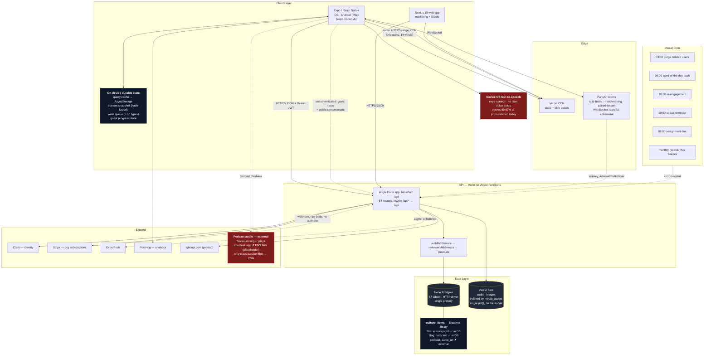
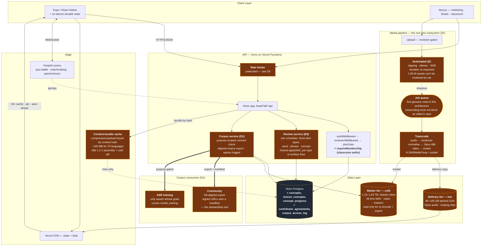

# Beeli — System Design

Written against the Standard Solution Template in `SystemDesign_StudyGuide.docx`
(sections 1–10, in order). Unlike the guide's case studies, this is not a
greenfield exercise: Beeli exists, so each section states **what is built today**
and then **what the design implies at 10×**. Where a number is an assumption
rather than a measurement, it is labelled `[ASSUMPTION]`.

Codebase snapshot: 54 API route modules (~23k LOC server), ~97k LOC mobile,
~53k LOC web, 57 Postgres tables, 45 explicit indexes.

---

## 1. Clarified Requirements

### Functional Requirements (in scope)

**Learner**
- A learner can browse published courses for a language and open a lesson (audio + transcript + culture notes).
- A learner can complete a lesson, which awards XP, advances a daily streak, and unlocks the next node on the journey map.
- A learner must pass a **checkpoint** (a generated round of questions over recently covered lessons) to unlock the next movement of a course.
- A learner encounters **everything they have been taught** — vocabulary, phrases, and lesson/grammar concepts — on an SM-2 spaced-repetition schedule (`server/src/lib/sm2.ts`), interleaved in a single review queue. *(Built for words and phrases; **not built for concepts** — see below and §5.)*
- A learner can search a language dictionary by word, English gloss, or category.
- A learner can write journal entries, optionally public, and see a community feed with likes and comments.
- A learner can play a real-time quiz battle against another learner (matchmaking or invite code).
- **Offline = all text, plus downloaded audio (D4).** The content snapshot carries every published text asset for the learner's language and works with no network. Audio is offline only where it has been fetched — automatically for review-queue clips, explicitly for lesson audio. See *Offline policy* below.
- A **guest** (unauthenticated) can learn and accumulate progress locally, then migrate that progress into a real account on sign-up.

**Educator — authoring (Studio)**
- A reviewer can author dictionary entries, sentences, proverbs, cultural content, lessons, and story arcs, scoped to the languages they are approved for.
- Authored content moves through `draft → in_review → published → archived` (`contentStatusEnum`).
- Every content mutation writes an immutable prior-state row to `content_versions` (the `snapshot` jsonb column — distinct from the offline *content snapshot*; see the terminology note in §2) and an actor-attributed row to `audit_log`.

**Educator — operating a classroom**
- A teacher can create a group and share an invite code; students self-join by code or by group id (`POST /classroom/groups/join-by-code`).
- A teacher can view the group roster and remove members.
- A teacher can assign a lesson to a group with a due date, and delete an assignment.
- A teacher can view **per-student progress across the roster** (`GET /classroom/groups/:id/progress`) — the view a lesson is actually run from.
- A student sees their assignments and due dates.

These two educator surfaces carry different guarantees, and the split is by
**authoring vs operating**, not by who is logged in (D2). Authoring can wait
until tomorrow; a teacher mid-class with thirty students cannot.

**Admin**
- An admin can publish/unpublish any content, run bulk CSV imports, manage languages, approve reviewer applications, and read platform stats.

**Billing / org**
- An organization can hold a Stripe subscription with a student seat limit; entitlement gates classroom size (`plus-gate.ts`, `billing.ts`).

**Corpus stewardship** *(added — see Decision D1)*

Beeli began as a language data collection project and was repurposed into a
teaching product. The collection never stopped; it is simply unlabelled. Three
channels are live in the schema today:

| Channel | Tables | Why it matters | **Measured 2026-07-27** |
|---|---|---|---|
| Aligned speech | `lessons.audio_url` + `transcript_segments` (`start_time`, `end_time`, `text`, `speaker`) | The exact input shape for fine-tuning an ASR model | **0 of 462 lessons have audio.** 10,056 aligned text segments, 11 speaker labels — all character names, not people |
| Crowdsourced audio with QA | `contributions` (`audio_url`, reviewer workflow, XP, bounties) | The Common Voice pattern, already shipped | ~21 entries with audio |
| Lexical pronunciation | `dictionary_entries.audio_url`, `.example_audio_url` | Isolated headword and example recordings | 14 with audio, 0 with example audio |

**Correction to this decision's original framing.** I wrote that lesson audio plus
timed segments *is* a force-aligned speech corpus. Measured, it is not: **no
lesson carries audio at all.** What exists is the *schema* for a speech corpus,
holding 10,056 aligned segments of text and essentially no speech — roughly 35
audio assets across the whole platform.

This does not weaken the decision. It changes the argument for acting now, and
strengthens it:

- The claim "you are accumulating unlicensed audio right now" was **wrong**. Almost nothing is being accumulated yet.
- The claim "consent is a one-way door" remains **exactly right** — and 35 assets is a door still standing open. Retroactively obtaining consent for 35 recordings is a weekend's work. For 50,000 it is impossible.

So the urgency is not that damage is accruing; it is that **this is the cheapest
moment this problem will ever have**, and it gets monotonically more expensive
from here. Build the provenance schema before the recording pipeline produces
volume, not after.

**Third reframing, and the one with the nearest deadline.** The absence of audio
is not only a corpus problem deferred to a future ASR project. §1's audio section
shows it is a *live pedagogical defect*: with no recordings, the app synthesises
Izon pronunciation using TTS engines that have no support for the language, and
one scored exercise grades learners against that output. Recording real audio is
therefore not groundwork for a later ambition — it is the fix for a present
defect in the core teaching function, and the corpus is the byproduct rather than
the motive. That ordering matters for sequencing: the recording pipeline earns
its place on the roadmap on teaching grounds alone, and D1 simply ensures that
when it runs, what it produces is licensed, attributed, and exportable.

One structural note for the export path. `contributions` and `dictionary_entries`
hold **separate content, not duplicates** — the contribution types split into two
families:

- **Standalone** (`word`, `phrase`, `audio`) — `dictionary_entry_id` is null; the contribution carries its own headword, gloss, category, and example. New lexical content, served alongside `dictionary_entries` by `selectDictionary`.
- **Enrichment** (`entry_audio`, `entry_meaning`, `entry_image`) — targets an existing entry via `dictionary_entry_id`; on approval the payload is merged into that entry (`routes/contributions.ts:508–535`).

Corpus audio therefore genuinely lives in two places — `dictionary_entries.audio_url`
and `contributions.audio_url` — and a provenance backfill or export must cover
both. They are different recordings, not two copies of one. (The enrichment family
is also double-served today; see §10 item 16.)

ASR is out of scope to *build*. Corpus provenance is in scope to *capture*,
because it is the only requirement in this document where deferring destroys
something unrecoverable.

- Every audio asset records the **speaker** (distinct from the uploader), the **recording context**, and a **licence grant** made under a known terms version.
- Every contribution carries durable, per-item **attribution** to its contributor.
- A contributor can **withdraw** a contribution, with the terms stating plainly that withdrawal cannot recall already-distributed copies.
- The full corpus is **exportable** in a standard format — aligned audio, transcripts, and an attribution manifest — without Beeli's cooperation being a precondition.

That last one is the load-bearing requirement. A steward is by definition
replaceable; if the community cannot take the corpus elsewhere, Beeli owns it in
practice regardless of what the terms say. Exportability is what makes
stewardship a fact rather than a claim.

### Non-Functional Requirements

| Property | Target | Status |
|---|---|---|
| Availability — learner path | 99.9% | Inherited from Vercel + Neon; no independent SLO measurement. Degrades to full offline rather than failing |
| Availability — classroom operation | 99.9% (D2) | Roster, assignments, and per-student progress are used live in a lesson. **Currently online-only** — no offline path, unlike the learner spine |
| Availability — Studio authoring | **Best effort (D2)** | A reviewer can return tomorrow. A multi-hour authoring outage is an accepted cost, not a gap to close |
| Lesson/course read latency | P99 < 300 ms warm | Served from client cache in the common case, so effectively ~0 ms |
| Content snapshot fetch | P99 < 3 s | **Warm passes, cold fails** — measured 1.5–1.9 s warm, 5.7 s cold (2026-07-26). Grows linearly with published corpus — see §2, §7 |
| Progress write ack | P99 < 500 ms | Optimistic UI; the write is enqueued, not awaited |
| Real-time quiz round-trip | P99 < 150 ms | PartyKit edge rooms |
| Durability | No completed lesson, checkpoint pass, or authored content lost | Enforced by unique indexes + idempotent replay |
| Consistency | Read-your-writes for the acting learner; eventual everywhere else | Optimistic local state + React Query invalidation |
| Offline | Cold launch with no network must still teach a lesson | Snapshot in AsyncStorage + persisted query cache |
| Corpus provenance | Every audio asset has a speaker, a context, and a licence grant | **Not met.** No consent, licence, or terms record exists anywhere in `server/src`, `mobile/`, or `web/app` |
| Corpus portability | Full aligned-corpus export on demand | **Not met.** No export path joins blob audio to `transcript_segments` |

**Consistency model, stated explicitly.** Beeli is **AP** for learner progress
and **CP-by-uniqueness** for the things that must not double-count. There is no
global linearizability requirement anywhere in the product.

The candidate counter-example is org seat entitlement, and it was checked rather
than assumed (D2). It does not qualify: overshooting a seat limit by one costs a
rounding error, where the study guide's B-15 Ticketmaster case — structurally the
same check-then-insert — cannot oversell a single seat. Same shape, different
consequence, different consistency requirement. Eventual plus a periodic
reconciliation sweep is correct here; a distributed lock would be cargo cult.

(Seat limits are separately **not enforced at all** today — an absent call, not a
consistency failure. See §10, item 3.)

### Audio — the requirement the rest of this document assumed

Beeli is a listening-first product: a Listen tab, an audio player store, a
transcript model with `start_time`/`end_time` per segment for synchronised
playback, a user-controlled offline download manager, an upload path, and blob
storage behind a CDN. **The audio architecture is complete. The audio is not.**

Measured 2026-07-27:

| | Measured | Consequence |
|---|---|---|
| Lessons with audio | **0 of 462.** `audio_url` null for every row; `BUNDLED_AUDIO` in `lib/mock-data.ts` is `{}` | The journey map computes `hasAudio: !!(audioUrl ?? BUNDLED_AUDIO[id])` — false on every node |
| Izon dictionary entries with recorded audio | **14 of 10,627 (0.13%)** | 99.87% of pronunciation is synthesised |
| Example-sentence audio | **0** | — |
| Fallback when no recording exists | `Speech.speak()` — device OS text-to-speech | See below |

**The fallback is the problem.** `lib/hooks/use-word-audio.ts:36` plays a recorded
clip when one exists and otherwise calls `Speech.speak(word, { rate: 0.85 })`
with **no `language` option**, so the device's default-locale voice reads Izon
orthography using that locale's phonology. Izon is tonal. No TTS engine on any
platform supports it. The synthesiser is not approximating Izon pronunciation —
it is applying English (or whatever the phone is set to) phonology to Izon
spelling.

Three call sites, three different behaviours, only one correct:

| Call site | Language passed | Assessment |
|---|---|---|
| `recall-bingo.tsx:175,202` | `"en"` on English prompt text | ✅ Correct — this is the L1 prompt, and English TTS is right for it |
| `say-it-back.tsx:125` | `selectedLanguageId` → `"izon"` | ❌ Not a BCP-47 tag and matches no installed voice; falls back to default |
| `use-word-audio.ts:36`, `word-challenge.tsx:81`, `dictation.tsx:93` | none | ❌ Device default locale voice |

**`dictation.tsx` is the sharp end.** The learner hears audio and types what they
heard, and `scoreAnswer` grades the result. With synthetic audio in the loop, a
learner can be marked wrong for correctly transcribing a word the synthesiser
mispronounced — or marked right for internalising a wrong pronunciation. That is
a scored exercise built on an unreliable signal.

**Requirements this establishes:**

- Recorded human audio is the **only** acceptable source for target-language pronunciation. TTS is acceptable for L1 prompt text (English) and nowhere else.
- Where no recording exists, the UI must **say so** rather than silently synthesising. A missing recording is a content gap; a wrong pronunciation is a taught error, and the second is worse than the first.
- No scored exercise may grade a learner against synthesised target-language audio.
- Offline means offline *including audio*: a downloaded lesson must play with no network. `lib/downloads.ts` already implements this properly — durable `Paths.document` storage, an AsyncStorage manifest, per-item delete, size accounting. It has nothing to download.

This reframes D1 a third time. The audio corpus is not only future ASR
groundwork and not only a stewardship obligation — **recording real audio
remediates a present, systematic defect in the core teaching function.** That is
the nearest-term argument for it and the strongest.

### Offline policy (D4)

**Text is always offline. Audio is offline where it has been fetched.** But the
two kinds of audio differ by two orders of magnitude in size, so one policy for
both would be wrong:

**Four storage tiers**, distinguished by who decides and what may be evicted:

| Tier | What | Size | Eviction |
|---|---|---:|---|
| **Baseline** | Text snapshot + review-queue audio (headwords, examples due within 7 days) | 11.4 + ~7 ≈ **18 MB** | Never — exempt from the cap |
| **Auto-ahead** | Next ~5 lessons on the path, maintained as the learner advances | ~5 MB | Rolling, automatic |
| **Opportunistic cache** | Any lesson played, kept afterwards | grows with use | LRU, only under cap pressure |
| **Pinned** | Explicit download — a lesson, a whole Movement, or a Discover library item | 1.1–1.8 MB / 54–90 MB | Only by the learner |

Coursework occupies all four tiers; the Discover library occupies only the last
two. Note that the tiers describe **why an asset is resident, not where it
lives** — everything shares one durable store and one manifest, and the tier sets
eviction priority. That matters because a podcast episode *is* a lesson: if it
sits on the learner's path it may already be present via auto-ahead, and opening
it from Discover simply finds it. One asset, one copy, whichever door the learner
came through.

**Opportunistic caching is retained.** An earlier draft of this decision rejected
it by pointing at the removal of `lib/audio-cache.ts` — which conflated the
mechanism with its bug. That module failed because it wrote to `Paths.cache` with
no manifest and no per-item control, so the OS silently evicted lessons learners
believed they had saved. The defect was *storage location and invisibility*, not
caching. Caching into `Paths.document` behind the existing manifest is sound and
makes replays free; the only rule it needs is that cached items are evictable and
pinned items are not.

**A flat cap governs the three audio tiers**, with the learner free to fill it
however they like:

```
Default cap     250 MB      warn on approach, LRU-evict cached tier first
                            ≈ 3–5 Movements plus cache
Ceiling         500 MB      ≈ 6–9 Movements
Baseline        ~22 MB      exempt — text and review audio always resident
```

**The ceiling deliberately does not cover the whole journey.** At the 5-minute
end, ten Movements is 900 MB. Whole-journey download is therefore *not* a
supported goal — the cap is sized so a learner can hold the Movements they are
actually working through, plus whatever caching accumulates behind them. Given a
target market on storage-constrained Android hardware, that is the right default;
the ceiling is adjustable for learners who want more.

The target market skews budget Android with constrained storage, which is why
the default is conservative and the ceiling is a deliberate choice rather than
the norm. `lib/downloads.ts` already tracks per-item size, so the downloads
screen can show usage against the cap with no new plumbing.

Review-queue audio is *snapshot-scale* — 7 MB against the text snapshot's ~15 MB.
Making a learner tap a download button for it would be ceremony over something
smaller than the text they already have, and it would leave the D3 review queue
silent offline, which defeats the point of spaced repetition being available
whenever the learner has a spare minute. The SRS schedule also makes the prefetch
precise: `next_review_at` says exactly which clips are needed soon, so the app
fetches tens of items rather than the language's full 170 MB of headword audio.

Lesson audio is the opposite — large, sequential, and something the learner
chooses deliberately, usually on wifi before travelling or before a class.

**The Discover media library is download-only plus opportunistic cache.** It never
enters the baseline and is never auto-fetched ahead — a learner gets a film,
podcast, or article offline by downloading it, or by having opened it before.
Discover is browsing, not coursework: prefetching a library the learner may never
touch would spend their storage cap on the app's guesses rather than their
choices.

**All three types are hosted in-house except podcast audio** — verified against
production 2026-07-27, not inferred from the schema comment:

| | Where content lives | Hosted | Catalog card | Content tier |
|---|---|---|---|---|
| **Film** | `scenes` jsonb inline (5–7 scenes); several also carry `body` and `show_notes`. Self-contained — *not* lesson-backed | ✅ DB | Baseline | **Download or cache** |
| **Blog** | **`body` text column**, 1.6–1.8k chars populated. `content_url` is a `beeli.app` canonical/share link, not the content itself | ✅ DB | Baseline | **Download or cache** |
| **Podcast** | `audio_url` only, pointing outward | ◐ 1 of 4 plays; rest are known placeholders (D7) | Baseline | **Download or cache** |

Splitting catalog from content is what makes the rule usable: the cards are a few
kilobytes and must be browsable offline, otherwise a learner with no signal
cannot see what exists to download later. The payload is the part that waits to
be asked for.

**Podcast audio is the one asset class this system does not hold**, and today it
does not exist anywhere. All four podcast rows are placeholders: two point at
`cdn.beeli.app`, which does not resolve, and one has no URL at all. The fourth
plays: a real hosted `freesound.org` file (200, 794 KB, `audio/mpeg`). Podcast is
therefore the one asset class served from outside the Blob → CDN path, and the
broken rows are known temporary placeholders rather than a defect (D7).

**Correction to an earlier draft of this section.** It stated that blogs point
outward and were therefore the one content type that could never honour D4. That
was wrong — read from the schema header comment (*"Metadata plus a pointer
outward"*) without checking the `body` column or the data. Every blog row carries
a populated body, and `content_url` is a share link to Beeli's own site. Blogs
are fully offline-capable. The header comment is stale relative to the schema it
describes and is worth fixing, since it is what produced the error.

**One inconsistency to fix.** Film scene graphs currently ship in the content
snapshot via `selectInteractiveStories()` — baseline treatment for download-only
content, placing every film's branching graph in every learner's always-resident
payload whether or not they ever open Discover. The selector should return
catalog cards only, with graphs fetched on open and then cached (§10 item 22).

**Requirements this establishes:**

- Explicit download is offered at **both** granularities — a single lesson (matching what `lib/downloads.ts` already keys on) and a whole Movement as one action, because 462 individual taps is not a workflow.
- **Movement is only a usable unit once course classification is fixed** (§10 item 21). Course sizes currently range 0–343 lessons, so "download this course" promises anywhere between nothing and 370 MB.
- The journey map already computes `hasAudio` per node; it needs a companion **downloaded** state, so a learner can see what will work offline *before* losing connectivity rather than discovering it after.
- A lesson opened offline with audio undownloaded degrades to **transcript-only with an explicit message** — never a broken or silent player.
- Cached and pinned items live in the same durable store and manifest, distinguished by a pinned flag. Only the cached tier is LRU-evictable, and only under cap pressure.

### Retrieval coverage (D3)

What currently re-surfaces, and what does not:

| Object | Table | Scheduling | Re-surfaces? |
|---|---|---|---|
| Dictionary word | `word_bank` | SM-2 (`ease_factor`, `interval`, `next_review_at`) | ✅ |
| Phrase / sentence | `phrase_bank` | SM-2, mirrors `word_bank` | ✅ |
| Word, challenge path | `word_progress` | **Leitner box 1–5** | partial, and by a *different* algorithm |
| In-lesson check | `lesson_checks` | none — fires once at `after_segment_index` | ❌ |
| Can-do statement | `can_do_checks` | none — `unique(user_id, lesson_id)`, one rating ever | ❌ |
| Checkpoint | `checkpoint_completions` | none — `unique(user_id, checkpoint_id)`, passed permanently | ❌ |
| **Grammar / lesson concept** | **no entity exists** | — | ❌ |

**The requirement is that concepts recycle like vocabulary does.** Today only
vocabulary does. Everything conceptual is taught once, gated once at a
checkpoint, and never seen again — which is precisely the material most in need
of spacing, since a grammatical pattern decays without retrieval in a way a
concrete noun does not.

Three obstacles, in order of how much they block:

1. **No concept entity.** `lessons.skills` is a bare `text[]` (`schema.ts:501`). A free-text tag can't be referenced reliably, localized through the `translations` map pattern, or given per-user state. Concepts have to become first-class before anything can schedule them.
2. **Nothing to ask.** SM-2 needs a card. A word's card is its dictionary entry; a concept has none. `lesson_checks` and `quiz_questions` are the natural item pool, but neither carries a concept reference, so a concept-review queue has nothing to draw from.
3. **Two algorithms for one job.** `word_bank` uses SM-2 and `word_progress` uses Leitner boxes; both model "how well does this learner know this word" and can disagree. The `sm2.ts` docstring claims the queues "age identically" — true of word and phrase banks, false of `word_progress`. Adding a third scheduler without resolving this makes it worse.

Design consequence: **one review service, three item types** — word, phrase,
concept — all aged through the shared `applySM2`, interleaved into a single
session rather than three parallel queues. Schema in §5.

**Failure raises review frequency; it never re-locks a checkpoint (D3).**
Checkpoints stay terminal — `unique(user_id, checkpoint_id)`, passed once and
permanently — so the journey-map progression invariant is untouched and the
offline gate logic in `mobile/lib/checkpoints.ts` needs no change. A learner is
never sent backwards through content they have already cleared.

This costs no new machinery: "raise the frequency" is precisely what `applySM2`
already does on a failed rating (quality 0 → repetitions reset to 0, interval to
1, ease factor reduced). The concept scheduler reuses the existing function
unchanged.

**One parameter does need to differ.** `nextReviewDate()` re-surfaces an `again`
rating after **10 minutes**, deliberately, so a missed word gets drilled inside
the same session. Applied to a grammar concept that is wrong: re-asking "the
*-mo* suffix" ten minutes after failing it tests working memory, not retention,
and inflates apparent mastery. Concepts want a floor of same-day or next-day
instead. That is a per-item-type parameter on the shared scheduler, not a second
scheduler — the distinction that keeps item 14 from recurring.

### Load-bearing vs degradable (D2)

Not every one of the 57 tables' worth of features carries the same guarantee, and
saying so is what makes §8's failure analysis honest.

**Spine — must not lose data, must work offline:** lesson → XP/streak →
checkpoint gate → journey progression, plus the dictionary and word bank. Also
the contribution pipeline, promoted here by D1: it feeds the corpus, so it
inherits the corpus's durability requirement rather than a feature's.

**Spine — must not lose data, currently online-only:** classroom roster,
assignments, and per-student progress. A teacher runs a live lesson off
`GET /classroom/groups/:id/progress`; losing the roster mid-class is not a
degraded experience, it is a stopped one. This tier exists because the classroom
carries the spine's *durability* requirement without (today) the spine's
*offline* guarantee — see the gap below.

**Degradable — may fail or lag without the product breaking:** multiplayer
battles, daily challenges, bounties, the community feed, story arcs, interactive
stories, can-do checks, word challenges.

This is why §8 can say "a lost quiz battle is acceptable" without hedging, and
why it cannot say the same about a lost contribution or a roster.

**Gap this exposes.** The learner spine survives a network drop; the classroom
spine does not. Every classroom route is a live API call with no snapshot
equivalent and no write-queue entry — `replayQueue()` handles `completeLesson`,
`trackListen`, `saveWord`, `removeWord`, and `passCheckpoint`, and nothing
classroom-shaped. A teacher on school wi-fi that drops loses the roster view
entirely. Whether that matters depends on where classrooms actually run, which is
a product question I can't answer from the code. Logged as §10 item 12.

### Explicitly Out of Scope

- Multi-region active-active. Single primary, no read replicas.
- Full-text relevance ranking (dictionary search is `ILIKE` prefix matching).
- End-to-end encryption of journals.
- Live-replica content editing (retired; Studio is form-based CRUD).
- Payment processing beyond Stripe Checkout + webhook.
- ASR / pronunciation scoring **as an implementation**. Explicitly *not* out of scope: the provenance and portability requirements above, which exist so ASR remains possible later. See Decision D1.

---

## 2. Scale Estimation (Back-of-Envelope)

Beeli is pre-scale. Traffic below is a **design envelope**; content volume is
**measured**.

### Measured content (2026-07-27)

From `GET /api/public/stats` and the Izon snapshot:

| | Measured | I had assumed |
|---|---|---|
| Dictionary entries, all languages | **12,299** across 9 languages | — |
| Izon dictionary entries (DB) | **10,627** — 86% of the entire corpus | ~5,000 (**2× low**) |
| Izon entries served in snapshot | **4,391** (41%) — published + approved contributions | — |
| Igbo | 1,006 | — |
| Other 7 languages | 85–100 each — seeded stubs, not corpora | "8 languages published" (**misleading**) |
| Izon lessons | **462** | ~400 ✓ |
| Izon transcript segments | **10,056** | — |
| Distinct speaker labels | **11**, all character names (`Ebiere`, `Tonye`, `Uncle Ere`, …) | — |
| **Lessons with audio** | **0 of 462** | assumed audio existed |
| Dictionary entries with audio | 14 in `dictionary_entries`; 35 in the snapshot — the gap is approved `contributions`, some double-served (§10 item 16) | — |

`[ASSUMPTION — still unmeasured]` Traffic: 50,000 MAU / 10,000 DAU as a year-1
envelope. PostHog holds the real figure.

Three of these change conclusions elsewhere in this document.

**The corpus is one language, not eight.** Izon is 86% of all entries; seven of
the nine "languages" hold ~95 entries each — seed sets, not corpora. Every
per-language scaling argument in §7 is really an argument about Izon's snapshot.

**41% of Izon is published.** 4,391 of 10,627 entries reach the snapshot. The
unpublished 6,236 are a *pending* payload increase: publishing the backlog roughly
doubles the dictionary portion of the snapshot without a single new entry being
authored.

**There is no speech corpus yet — zero of 462 lessons carry audio.** This
corrects D1 materially and is handled there.

### The planning unit: 1 Izon

Today's numbers are not the design target — they are a *sample of one language*,
useful precisely because it is the deepest one. So define a unit and multiply.

**1 Izon** = one language **built out**, not one language as it stands today.
Today's Izon is the best available sample, but it is mid-construction: 41% of the
dictionary unpublished, 8 of 10 Movements barely started, and the sentence,
proverb, and cultural shelves still at seed size. Planning against those figures
would design for a construction site.

| | Today (measured) | **Ideal state (planning basis)** | Basis |
|---|---:|---:|---|
| Dictionary entries | 10,627 (41% published) | **10,627, fully published** | Already at target — exceeds most of `LANGUAGE_TARGETS` (Hausa 10,000, Efik 14,000, Oromo/Akan 5,000) |
| Narrative lessons | ~84 real (462 rows incl. 343 dictionary shelves) | **500** | 10 Movements × 50, owner-set |
| Transcript segments | 10,056 | **~15,000** | 500 lessons × ~30 segments |
| Sentences | 108 | **~2,000** | seed-size today; a built-out sentence bank |
| Proverbs | 19 | **~500** | seed-size today |
| Cultural items | 25 | **~300** | seed-size today |
| Discover library — films | 7 | **~30** | `culture_items type='film'` — self-contained `scenes` graphs, not lesson-backed |
| Discover library — podcasts | 4 | **~10 seasons** | `story_arcs` + `story_chapters`; **episodes are lessons** |
| Discover library — blogs | 3 | **~100** | text articles, `body` column — hosted in-house |
| **Text snapshot** | 6.94 MB raw / 1.23 MB gz | **~15 MB raw / ~2.7 MB gz** | derived from the above at measured bytes-per-row |

The text snapshot roughly **doubles** at ideal state, and only about half of that
comes from publishing the dictionary backlog — the rest is the sentence, proverb,
and cultural shelves growing from seed to real. Those are invisible in today's
measurement (they total 82 KB) and are a material share of the built-out payload.

### Target state: 70 × Izon, built out

| | 1 Izon | **70 languages** |
|---|---:|---:|
| Dictionary entries | 10,627 | **744,000** |
| Narrative lessons | 500 | **35,000** |
| Transcript segments | ~15,000 | **~1.05 M** |
| Total content rows | ~29,000 | **~2 M** |
| Content DB size | ~45 MB | **~3 GB** |
| **Per-learner text download** | ~15 MB raw / 2.7 MB gz | **~15 MB — flat.** A learner fetches one language; 70 languages changes nothing for any individual |
| **Server cache footprint** | 2.7 MB gz | **~190 MB gz** — every language's bundle held at once |

Those last two matter most, and they pull in opposite directions. Learner cost is
**constant** in language count; server cost is **linear** in it. Even at ideal
state the linear side lands at ~190 MB — still small enough for any cache tier,
so the caching fix (§10 item 5) never becomes the expensive side. The conclusion
survives doubling every input, which is the useful thing to know about it.

> **Terminology — two different things are called "snapshot" in this codebase.**
>
> - **Content snapshot** — the offline bundle served by `GET /api/content/snapshot?lang=…` and cached client-side (`mobile/lib/content-snapshot.ts`). Read-path, per-language, hash-versioned. **Every use of "snapshot" in §2, §7, and §10 item 5 means this one.**
> - **`content_versions.snapshot`** — a `jsonb` column holding the full prior state of a single content row, written on every edit for the editorial workflow (§5, D1 attribution, §10 item 7's retention problem). Write-path, per-entity, unbounded.
>
> They share a name and nothing else. The retention problem belongs to the
> second; the payload problem belongs to the first. Worth renaming one of them in
> code — `content_versions.state` or `contentBundle` for the read path — since the
> collision has already caused confusion in this document.

**The database is a non-event.** 2 M content rows and ~3 GB is a small Postgres
by any measure — three orders of magnitude below where partitioning starts to
matter. Nothing in §5 needs to change for 70 languages.

**Language is a clean shard key, and that is the load-bearing property.** Every
content table carries `language_id`; every learner reads exactly one language's
content at a time. So 70 languages is 70 independent slices, not one system 70×
bigger. Reads do not fan out across languages, and a learner's text snapshot
stays ~15 MB whether the platform hosts one language or seventy.

**Request volume** — parametric, since DAU is the one unmeasured number:
```
Per 10,000 DAU:  10,000 × 1 session × ~25 calls = 250,000 req/day ≈ 3 RPS avg
                 peak factor 10× (evening study) ≈ 30 RPS peak
At 200,000 DAU (a plausible 70-language success state):
                 5 M req/day ≈ 58 RPS avg, ~600 RPS peak
```
Even 600 RPS peak against stateless functions and a single Neon primary is
ordinary. **The system is not throughput-bound at any scale this product
plausibly reaches. It is payload-bound, cache-bound, and editorially bound.**

**The dominant read: the offline snapshot** — *measured, not assumed*

`GET /api/content/snapshot?lang=izon` against production, 2026-07-26:

```
Uncompressed payload                6,939,233 B   = 6.94 MB
Gzipped wire size                   1,227,185 B   = 1.23 MB   (5.7× ratio)
TTFB, cold                          5.07 s
TTFB, warm                          1.16 – 1.41 s
Total, warm                         1.51 – 1.86 s
Response headers                    cache-control: public, max-age=0, must-revalidate
                                    x-vercel-cache: MISS      (every request)
                                    ETag:                     ABSENT
```

The size estimate was sound (6.94 MB against a guessed 4–8 MB). **The cost model
was not.** I assumed transfer dominated; it doesn't — gzip already cuts the wire
cost 5.7×, so the expensive part is the **server-side assembly**: ~1.2 s of
function time, on every single request, to rebuild a payload that is usually
byte-identical to the one the client already holds.

`must-revalidate` with no `ETag` is the specific defect. The header instructs the
client to revalidate, and then gives it nothing to revalidate *with*, so every
"has anything changed?" poll costs a full multi-table read, a full serialization,
and a full 1.23 MB transfer to answer "no".

```
Daily cost of polling, at 10,000 DAU [ASSUMPTION: DAU only]
  Function time   10,000 × 1.2 s   ≈ 12,000 s/day  ≈ 3.3 compute-hours
  Egress          10,000 × 1.23 MB ≈ 12.3 GB/day
Of which the useful fraction — polls where content actually changed — is
roughly 1 in 7, so ~85% of both figures is pure waste.
```

**Where the 6.94 MB actually goes** — measured by serializing each key
separately:

| Key | Size | Share | Contents |
|---|---:|---:|---|
| `lessons` | 4,860 KB | **63%** | 462 lessons + 10,056 transcript segments |
| `dictionary` | 2,778 KB | **36%** | 4,391 entries |
| `sentences` | 36 KB | 0.5% | 108 |
| `cultural` | 35 KB | 0.5% | 25 |
| `interactiveStories` | 17 KB | 0.2% | 6 |
| `proverbs`, `courses`, `scripts` | 22 KB | 0.3% | 19 / 13 / — |

**Two keys are 98.5% of the payload**, which sharpens §7's fix considerably. A
per-course split targets `lessons` (63%) and works well — lessons belong to
courses, so a learner on Movement 1 genuinely doesn't need Movement 10's
transcripts. But it does **nothing** for `dictionary` (36%), which isn't
course-scoped: a learner can look up any word at any time. Those two need
different strategies, and the design I proposed at the end of §10 only addressed
one of them.

Two caveats on this table, both from §10. The `lessons` row counts 462 rows of
which 343 are the misclassified dictionary shelf (item 21), so the real narrative
share is smaller and the dictionary's true share larger than it appears. And
`interactiveStories` should not be in this payload at all under D4 (item 22) —
it is baseline treatment for download-only content.

Trajectory: publishing Izon's unpublished 6,236 entries roughly doubles the
dictionary key on its own, and at ideal state the text snapshot reaches ~15 MB
per language with assembly time scaling alongside it. This is the single most
important scaling limit in the system, and the measurement moves §10 item 5 from
housekeeping to the top of the engineering queue. See §7 and §10.

**Write volume** — scales with *users*, not languages, so 70× changes nothing
structurally:
```
Per 10,000 DAU:
  3 lesson completions each          = 30,000 writes/day  ≈ 0.35 W/s
  20 SRS reviews each (D3: words +
  phrases + concepts)                = 200,000 upserts/day ≈ 2.3 W/s
At 200,000 DAU, peak 10×             ≈ 600 writes/s
```
Against the guide's ~5,000–10,000 TPS single-node Postgres ceiling, 600 W/s peak
has an order of magnitude of headroom. **No sharding is justified at 70 × Izon.**
Note D3 raises review volume — three item types instead of one — but reviews are
single-row idempotent upserts on `(user_id, item_id)`, the cheapest write shape
in the system.

**Database storage at 70 × Izon**
```
Content (text)          ~3 GB          — trivial
Learner state           scales with users, not languages:
                        200k users × 200 saved items ≈ 40 M rows ≈ 4 GB
content_versions        70× the editorial volume, still unbounded — needs the
                        retention policy from §10 item 7 before, not after
```
Under 10 GB of Postgres at full build-out across 70 languages. Media is a
different order of magnitude in a different store, and is estimated in full
below — after stating the assumption that makes it real, because today almost
none of it exists.

### Estimating with audio filled — the one case that changes the architecture

Every estimate so far describes a system whose audio is absent. Assume it is
complete: every lesson recorded, every headword and every example sentence
recorded, across 70 languages.

**Agreed planning basis.** A built-out language is **10 Movements × 50 lessons ×
3–5 min**. This is an owner-set planning figure, not a derived one, and it
supersedes the earlier calculation from today's 462-row lesson count — which was
inflated by the dictionary shelf in §10 item 21. Nothing in the database could
validate a duration assumption in any case: `duration` carries no usable data,
and the column's own comment records that the podcast converter wrote minutes
into a seconds field until Jul 2026.

Word clip 2 s; example sentence 4 s. Two encodings, because a corpus and a
delivery format are not the same artifact — **master** at 48 kHz/16-bit mono WAV
(96 KB/s), **delivery** at Opus 48 kbps mono (6 KB/s).

**The Discover media library must be counted too.** `culture_items` holds three
types — `film` | `podcast` | `blog` — and an earlier draft of this estimate
omitted all three. Today: 7 films (5–7 branching scenes, 6–12 min), 4 podcasts
(`duration` 7,200 s, audio unhosted), 3 blogs (4-min reads, bodies stored in the
`body` column). Only podcasts reference audio at all, and none of those URLs
resolve.

One structural fact removes most of the double-counting risk: **podcast episodes
are lessons.** `story_chapters.lesson_id` is `notNull` and references `lessons`,
so a season is a narrative wrapper (intro/outro) around lesson rows. Podcast
audio *is* lesson audio — not additive. Films are the genuinely uncounted audio,
if their scenes get voiced; blogs are text and stay text.

| Per language | Count | Duration | Delivery | Master |
|---|---:|---:|---:|---:|
| Lessons (10 × 50) | 500 | 25 – 41.7 h | 540 – 900 MB | 8.6 – 14.4 GB |
| Headwords | 10,627 | 5.9 h | 128 MB | 2.04 GB |
| Example sentences | 10,627 | 11.8 h | 255 MB | 4.08 GB |
| Film scenes — voiced `[ASSUMPTION: 30 films × 7 scenes × ~85 s]` | 210 | 5 h | 108 MB | 1.73 GB |
| Podcast episodes | (= lessons) | — | — | — |
| Blogs | ~100 | text only | — | — |
| Film scene clips — muted loop | 210 | (silent) | 105 MB | 1.05 GB |
| **Total** | **22,174** | **47.7 – 64.4 h** | **1.14 – 1.50 GB** | **17.6 – 23.3 GB** |

**Film audio attaches to scenes, not films** — a film is a branching graph, so
the unit is the node. That leaves the hours unchanged (5 h per language) but
multiplies the asset count sevenfold: **14,700 scene recordings at 70 languages**,
not 2,100 films. It also needs a schema change — `InteractiveStoryScene`
(`schema.ts:1524`) carries `id`, `type`, `gradient`, `title`, `text`, and
`choices`, with **no audio field**. Voiced scenes need `audioUrl` and a
`duration` on that type.

**Scenes also carry a short visual clip**, which is a heavier asset class than
anything else in this estimate:

| Per language | Count | Delivery | Master |
|---|---:|---:|---:|
| Scene clips — 3–5 s muted loop, 720p | 210 | **105 MB** | ~1.05 GB |

```
70 languages → 14,700 clips → ~7.4 GB delivery, ~73 GB master
```

**Encode these as muted looping MP4/WebM, not GIF.** GIF is 5–10× larger for the
same few seconds, has no hardware decode path, and caps at 256 colours — a 3 s
720p GIF runs 2–5 MB where an H.264 loop of the same footage is ~500 KB. At
14,700 clips that difference is roughly 7 GB versus 50 GB of delivery tier, and
on a budget Android device it is the difference between a scene that plays and
one that stutters. "GIF" is the right *idea* — short, silent, looping — and the
wrong *container*.

The scene type already has its own visual fallback: `gradient: [string, string]`
is rendered today, so it becomes the poster frame and the graceful degradation
when a clip is missing or still downloading. Nothing new is needed for the
absent-media case, which is unusual in this codebase and worth noticing.

**The honest cost here is production, not infrastructure.** 7.4 GB of delivery
media is trivial to store and serve. Shooting, editing, and colour-matching
**210 clips per language** is a video production programme — a materially larger
undertaking than voice recording, and one that scales 70×. §2's editorial-capacity
finding applies here with more force than anywhere else in the document.

Two consequences of branching worth stating. Offline requires **every** scene's
media, since the path a learner takes cannot be predicted — a film download is
the whole graph at ~7 MB (audio plus clips), small enough that partial download
would be false economy. And adding per-scene audio references grows the `scenes` jsonb
that currently ships in every learner's snapshot, which sharpens §10 item 22 from
a tidiness point into a payload one.

| At 70 languages | |
|---|---:|
| Media assets | **~1.55 M** — incl. 14,700 voiced scenes + 14,700 scene clips |
| Recorded speech | **3,340 – 4,510 hours** |
| Delivery tier | **80 – 105 GB** |
| **Master tier** | **1.23 – 1.63 TB** |

Three numbers there reorder the design.

**1. Audio is 60–85× the text.** A learner's full-language offline payload goes
from ~15 MB to 1.14–1.50 GB. Every optimisation in §10 item 5 — `ETag`, caching,
per-course splitting — is then tuning about **1%** of what a learner downloads.
Those fixes stay correct for *server* cost, since the snapshot is polled
repeatedly while audio is fetched once, but the *learner-bandwidth* conversation
stops being about JSON entirely. Offline granularity has to drop below the
language:
```
one lesson              1.1 – 1.8 MB   trivial
one Movement (50)        54 –  90 MB   reasonable on mobile data
full journey (10 Mv)    540 – 900 MB   wifi, deliberate
full language + lexicon  1.14 – 1.50 GB
```

**Consequence for D4's cap.** At the 5-minute end a full journey is 900 MB — so
the 500 MB ceiling set in D4 does **not** cover downloading the whole path. That
is a defensible position (nobody needs ten Movements resident at once, and the
cap is adjustable), but it should be a stated choice rather than an accident of
two numbers set in different sections. Either raise the ceiling to ~1 GB, or
state plainly that whole-journey download is not a supported goal and the cap is
sized for three to six Movements plus cache.

**2. Egress becomes the largest infrastructure line, by orders of magnitude.**
```
200,000 DAU × 3 lessons/day × 1.1–1.8 MB  ≈ 660 – 1,080 GB/day
+ 20 SRS reviews/day × 12 KB × 200,000    ≈            48 GB/day
                                            ────────────────────
                                            0.7 – 1.1 TB/day ≈ 21 – 34 TB/month
At ~$0.08/GB CDN egress                    ≈ $1,700 – 2,700/month
```
Not alarming in absolute terms — but set it against ~$5/month for blob storage
and ~190 MB of snapshot cache, and audio is essentially the entire infrastructure
bill. **This is what finally makes offline download a cost lever rather than a
convenience**: a downloaded lesson is transferred once instead of once per play.
The download manager built in `lib/downloads.ts` turns out to be a
cost-optimisation asset that predates the cost.

**3. Masters need a second storage tier.** 1 TB of WAV is cold data — touched
only for re-encoding and corpus export, never by a learner. Keeping it in the
same hot blob store as delivery copies is a straightforward waste; it belongs in
Glacier-class storage at roughly a tenth the price. That split does not exist
today: `routes/upload.ts` does a single `put()` to Vercel Blob with no
transcoding, no normalisation, and no tiering.

#### What the design actually gains

Five components, none of which exist:

| Component | Why audio forces it |
|---|---|
| **Transcoding pipeline** | Audio: validate → loudness-normalise → derive Opus. Video: transcode scene clips to a muted H.264/WebM loop with a poster frame. Master cold, delivery hot. Today `upload.ts` stores exactly what was uploaded, so bitrate, loudness, and now codec vary per contributor |
| **Job queue** | Transcoding is slow, bursty, and must not block an editor's save. §3 records "no message queue — correct at this scale"; **with audio filled that judgement flips.** This is the first genuine need for one in the architecture |
| **Two-tier storage** | Masters cold (~1 TB), delivery hot behind CDN (~62 GB) |
| **Automated audio QC** | 1.52 M assets cannot be reviewed by ear one at a time. Clipping, silence, SNR, duration-versus-expected as automated gates, with sampled human review on top — otherwise the review workflow becomes the bottleneck it already is for text |
| **Bulk corpus export** | D1's export promise at 1 TB is not an API response. Signed URLs over a manifest, or requester-pays object access — a transfer mechanism, not an endpoint |

#### What conspicuously does not change

Postgres stays a small database — audio adds columns and ~1.5 M `media_assets`
rows, nothing structural. The API shape, PartyKit, the auth chain, the write
queue, and the absence of sharding are all untouched. **The entire audio problem
lives in object storage, a pipeline, and a CDN**, orthogonal to everything §4
describes.

That orthogonality is the real finding. Filling in the audio does not invalidate
this architecture — it bolts a media subsystem onto its side, and the existing
system carries on unchanged underneath. Which is a good outcome, and not the one
I expected before running the numbers.

### The corpus at 70 × Izon — the strategic number

This is what D1 is actually protecting, and it deserves its own estimate:

```
Lesson audio       35,000 lessons  × 3–5 min = 1,750 – 2,917 h  aligned, multi-speaker
Headwords         744,000 clips    × 2 s     =           413 h  isolated, citation form
Example sentences 744,000 clips    × 4 s     =           827 h  short read speech
                                               ────────────────
Film scenes       14,700 scenes    × 85 s    =           350 h  voiced branching narrative
                                               ────────────────
                                               3,340 – 4,510 h across 70 languages
Per language                                   ≈ 48 – 64 h
```

**Voiced film scenes are a distinct data class, and the corpus model should say
so.** Lesson and film audio are *performed* — scripted, acted, emotionally
inflected — while headwords and example sentences are citation-form recordings.
For ASR fine-tuning that mix is an asset: performed speech supplies prosody,
tempo variation, and connected-speech phenomena that citation forms never
contain. But it must be labelled, because performed speech is not spontaneous
speech and a model trained as though it were will misjudge its own confidence.
`media_assets` (§5) should carry a `speech_style` alongside `recording_context`:
`citation` | `performed` | `spontaneous`.

The same distinction applies to provenance under D1. A voice actor's consent is
not a native-speaker contributor's consent, and `transcript_segments.speaker`
already stores a *character* name rather than a person — the identity of whoever
performed the line is not recorded anywhere. Films make that gap concrete:
14,700 scene recordings, each performed by someone whose grant and attribution
must be traceable, against a schema that currently records only who uploaded the
file.

**Fifty to sixty-five hours per language** is the number to hold onto, and it is a
materially better position than lesson audio alone would give. It is **not**
enough to train ASR from scratch — that wants hundreds. It **is** comfortably
enough to fine-tune a multilingual base model (MMS, Whisper) into usable
recognition, and the mix is unusually good: continuous multi-speaker speech from
lessons, plus citation-form headwords and short read sentences. That composition
is close to how purpose-built low-resource corpora are deliberately assembled —
here it falls out of the product's own structure rather than having to be
designed for.

And for most of the 70, it would be the **largest speech corpus that has ever
existed** for that language. That is the asset. It is also why the provenance
schema (§5, D1) has to exist before the recording pipeline produces volume rather
than after: 1,615 hours collected without licence grants is 1,615 hours that
cannot lawfully train anything.

**Classroom load (added by D2).** Promoting the classroom to the spine raises the
question of whether it introduces a load profile the rest of §2 misses. It does
not, and it is worth showing why rather than asserting it.

The shape is a **burst read at class start**: a teacher opens the roster view,
thirty students open their assignment lists, all inside a minute.

```
GET /classroom/groups/:id/progress = 3 queries, not N+1:
  1 roster read, 1 aggregate over user_progress (inArray + groupBy), 1 assignments read
Rows aggregated: 30 students × ~100 completed lessons ≈ 3,000
Served by user_progress_user_lesson_idx (user_id is the leading column)

Burst: 1 teacher + 30 students, ~31 requests in ~60 s ≈ 0.5 RPS per classroom
100 concurrent classrooms                              ≈ 50 RPS
```

Even a hundred simultaneous classes lands in the same order of magnitude as the
whole-system peak already estimated. **The classroom is not a scaling problem.**
Its risks are correctness and authorization (§10, items 11 and 13), which is a
useful reminder that promoting something to the spine raises its *guarantee*
requirements without necessarily raising its *load*.

### What actually breaks at 70 × Izon

Almost everything scales linearly, because language is a clean shard key. Three
things do not, and only one of them is an engineering problem.

**1. Snapshot caching gets *harder* as languages multiply — the counter-intuitive
one.** Today one language carries all traffic, so the function stays warm and
assembly is the measured 1.2 s. At 70 languages the same traffic is spread across
70 distinct payloads. The head language stays warm; **the tail is always cold.**
A language with one request an hour pays the 5.1 s cold path every single time,
and there is no `x-vercel-cache` hit to save it because nothing is cached at all.

The fix scales, though, and cheaply:
```
70 languages × ~2.7 MB gzipped = ~190 MB of cached payload, total
```
190 MB is nothing — it fits in a small Redis, an edge KV, or Vercel's data cache.
**Cache the compressed payload keyed by content hash and the tail problem
disappears** along with the assembly cost. This is §10 item 5, and it goes from
"important" to "structural" at 70 languages.

**2. Media egress, not media storage.** The delivery tier (80–105 GB) costs a
few dollars a month to store; the same
bytes served repeatedly is the real bill. Offline download already mitigates
this — it converts repeat streaming into one-time transfer — which is a case of an
existing UX decision paying an unplanned infrastructure dividend.

**3. Editorial capacity — the binding constraint, and it is not technical.**
```
70 × 462 lessons          = 32,300 lessons to author and review
70 × 10,627 entries       = 744,000 dictionary entries to author and review
At an optimistic 10 reviewed entries/hour ≈ 74,000 review-hours
                                          ≈ 37 person-years of native-speaker review
```
Nothing in this document's infrastructure is remotely challenged by 70 languages.
The content is. **The system that needs to scale to 70 languages is the
contribution and review pipeline, not the API** — which reframes what §7's
"scalability" section should be optimising for: reviewer throughput, bulk import
quality, bounty targeting, and contributor retention are the levers that matter,
not RPS.

This is also the strongest argument for D1's community-ownership decision on
purely practical grounds: 37 person-years of native-speaker expertise is not
something a company hires. It is something a community contributes, and only if
the terms make contributing worth it.

### Which of these numbers actually matter

Most of the above is decoration. Two numbers change decisions, and both are
currently unmeasured:

| Number | Decides | Status |
|---|---|---|
| **Snapshot size and assembly cost** | Whether `ETag`/`304` (§10 item 5) is housekeeping or urgent | ✅ **Measured** — 6.94 MB raw, 1.23 MB gzipped, ~1.2 s warm assembly, no `ETag`. Verdict: urgent |
| **Snapshot composition** | *Which* split strategy to build | ✅ **Measured** — `lessons` 63%, `dictionary` 36%. Two keys, two different fixes |
| **Corpus size and audio coverage** | Whether the ASR provenance work is urgent or premature | ✅ **Measured** — 10,627 Izon entries, ~35 audio assets platform-wide. Verdict: urgent *because* it is still cheap |
| **Real DAU** | Whether "not throughput-bound" is a finding or a guess. Below ~1,000 DAU most of §7 is theatre and should say so | ❌ Open — PostHog is already instrumented client-side |

Everything else in this section — RPS, storage growth, bandwidth — derives from
those and needs no independent measurement. DAU is the only gap left, and it
changes emphasis rather than conclusions.

### What measuring changed

Worth recording, because the pattern was consistent: **every estimate was close
on magnitude and wrong on the conclusion drawn from it.**

| Estimate | Measured | What flipped |
|---|---|---|
| Snapshot 4–8 MB | 6.94 MB ✓ | Nothing on size — but transfer was assumed dominant, and assembly is. Changes the fix from `ETag` alone to caching the assembled payload first |
| ~5,000 Izon entries | 10,627 | 2× low; and only 41% is published, so a large payload increase is already queued behind the review workflow |
| "8 languages published" | 1 real, 1 partial, 7 stubs | Per-language scaling arguments are really one argument about Izon |
| Aligned speech corpus exists | 0 of 462 lessons have audio | Reverses D1's urgency argument — from "damage is accruing" to "this is the cheapest this will ever be" |
| Content = lessons + lexicon | A whole Discover library (film / podcast / blog) was omitted | Films add ~350 h of voiced scenes and 14,700 clips; podcast episodes turn out to *be* lessons, so they add nothing |
| Blogs point outward, unhostable | `body` column populated in every row | I read a stale schema comment instead of the data and got it backwards |

A size check alone would have passed the first row and missed every conclusion
below it. The guide is right that a confidently-stated assumption beats an
unstated one; this is the case for why neither beats a measurement — and why the
thing worth measuring is usually not the headline number but the *shape*
underneath it.

Until DAU is real, treat every conclusion in §7 about *when* a limit bites as
unfounded, and every conclusion about *which* limits exist as sound — those came
from reading the code, not from these numbers.

### §2 in summary

**Not throughput-bound, at any scale this product plausibly reaches.** 600 RPS
peak at 200,000 DAU against stateless functions and one Neon primary is ordinary.
Under 10 GB of Postgres at 70 languages fully built out. No sharding, no
replicas, no second region justified by these numbers.

**Language is a clean shard key**, and that is the property carrying the whole
design: 70 languages is 70 independent slices, not one system 70× larger. Learner
cost stays constant in language count; only server-side cache footprint is
linear, and it lands at ~190 MB.

**Three things actually constrain the system**, in ascending order of how hard
they are to fix:

1. **Content-bundle assembly and caching.** ~1.2 s per request rebuilding a usually-unchanged payload, with no `ETag` and no cache. Gets *worse* with more languages as the traffic tail goes cold. Cheap to fix, and §10 item 5 is now the top engineering item.
2. **Media egress.** 21–34 TB/month at 200,000 DAU once audio exists — essentially the entire infrastructure bill, against ~$5/month for storage. Offline download is the lever, which is why D4's tiers are a cost decision as much as a UX one.
3. **Editorial and production capacity.** ~37 person-years of native-speaker review, plus 210 video clips per language. Nothing in the infrastructure is troubled by 70 languages; the content pipeline is the binding constraint, and it is a human one.

**Filling in the audio does not re-architect anything.** It bolts a media
subsystem — transcoding, job queue, two-tier storage, automated QC — onto the
side, while Postgres, the API, PartyKit, auth, and the write queue carry on
unchanged. That orthogonality was the least expected result of this section.

**And the asset that falls out of building the product is worth naming.**
3,340–4,510 hours of transcribed, aligned, speaker-attributed speech —
48–64 hours per language — in a mix (performed narrative, citation forms, read
sentences) close to how low-resource corpora are deliberately composed. For most
of these 70 languages that would be the largest speech corpus ever assembled.
It is a byproduct of teaching, not a separate programme, which is precisely why
D1's provenance requirements have to be in place before the recording starts
rather than after.

---

## 3. High-Level Architecture

Two diagrams. **3.1 is what exists**, verified against the code. **3.2 is what
D1–D4 and the §2 measurements imply.** Keeping them separate is deliberate: a
single diagram that blends built and planned is how a design document quietly
becomes fiction.

### 3.1 As built



**Note the red node.** The original version of this diagram routed audio from
Vercel Blob through the CDN to the client and stopped there — architecturally
tidy and, in practice, describing a path that carries almost no traffic. The
actual dominant audio path today is the client calling device TTS, which appears
in no data store, crosses no service boundary, and was therefore invisible to a
box-and-arrow reading of the system. It is drawn here because a diagram that
omits how the product actually makes sound is not a diagram of this product.

**Conventions.** Solid arrows are synchronous request/response; dashed arrows are
asynchronous, server-to-server, or unauthenticated; every arrow carries its
protocol. Redraw in Excalidraw for session use — this version is the
version-controllable source of truth.

**The shape in one sentence:** a single stateless Hono API in front of one
Postgres primary, with all latency-sensitive real-time work pushed out to
PartyKit edge rooms and all latency-sensitive read work pushed *into the client*
as a hash-versioned content snapshot.

**What is deliberately absent**, since the template asks for each and their
absence is itself a design statement:

| Template element | Beeli | Assessment |
|---|---|---|
| Load balancer / API gateway | Vercel edge routing; no separate gateway | Correct — a gateway would add a hop and own nothing |
| Message queue / event bus | **None server-side.** The only queues are the *client's* write queue and the `matchmaking_queue` table | Correct *while audio is absent*. §2's audio-filled estimate flips this: transcoding is slow, bursty, and must not block an editor's save. That is the first genuine need for a queue in this architecture — notification fan-out (§10 item 10) is the second |
| Server-side cache | **None** | Was defensible; §2's measurements make it the top structural gap |
| Rate limiter | **None** | Gap, §10 item 4 |
| Service mesh / discovery | None — one service | Correct |
| CDN | Vercel CDN, static + blob | Present |

### 3.2 As decided

The same system with D1–D4 and the §2 measurements applied. **Amber nodes are
additions**; everything else is unchanged from 3.1, which is the point — none of
these decisions require re-architecting.



**What changed, and what conspicuously did not.**

| Added | Why | Decision |
|---|---|---|
| Content-bundle cache | Assembly is the dominant cost (measured 1.2 s); at 70 languages the long tail is always cold | §2 |
| Review service | Concepts must recycle, not just vocabulary — one scheduler, three item types | D3 |
| Corpus service | Consent is purpose-scoped, egress is logged, export is the stewardship test | D1 |
| **Media pipeline** | QC → queue → transcode → two tiers. `upload.ts` currently does one `put()`, so bitrate, loudness, and codec vary per contributor | §2 audio-filled |
| **Job queue** | Transcoding is slow and bursty and must not block an editor's save. 1.55 M assets | §2 |
| **Two-tier storage** | 80–105 GB hot behind CDN; 1.23–1.63 TB of masters cold at a tenth the price | §2 |
| `requireMembership` | Three classroom endpoints have no object-level authz | §10 item 11 |
| Rate limiter | Still undecided — drawn to mark the hole, not to claim it is filled | D5 pending |

**Two things changed since the first draft of this section, and the correction
matters.** That draft concluded "no new datastore, no queue" — true at the time,
because the audio did not exist. Working the audio-filled estimate in §2 flipped
both: a cold master tier is a second store, and transcoding is the first genuine
queue in this architecture. The judgement was right about the system as measured
and wrong about the system as intended, which is the specific failure mode of
designing against current state.

**What still holds is the more important claim.** No sharding. No second region.
No change to Postgres, the API shape, PartyKit, auth, or the write queue. The
media pipeline is **orthogonal** — it hangs off the side, feeds a CDN, and the
transactional system underneath is untouched by it. Four substantive product
decisions and twenty-three findings later, the core boxes are the same boxes.

Two genuinely new *shapes*, both consequences of decisions rather than
optimisations:

- **The corpus consumer edge** — community export and purpose-gated ASR training. D1 turned a byproduct into an obligation, and obligations need paths out of the system that a teaching app alone would never draw.
- **The media pipeline** — because filling the audio is the one change that adds a subsystem rather than a module.

---

## 4. Core Component Deep Dives

One subsection per box in §3.2, each covering responsibility, technology choice
(including what was rejected), internal state, and failure mode. **4.1–4.5 and
4.10 exist today. 4.6–4.9 are what D1, D3, D4, and the §2 measurements add** —
and all four are modules or side-cars rather than changes to the components
above them, which is the claim §3.2 makes and this section is where it is
checked.

### 4.1 Mobile client (Expo SDK 54, React Native, New Architecture)

**Responsibility.** Owns the entire learner experience, and — unusually — owns a
meaningful share of the *system's* correctness. It is not a thin view: it holds
the content snapshot, the offline write queue, and the guest progress store, each
of which is a durable replica of server state.

**Technology choice.** Expo + expo-router for one codebase across iOS/Android/web.
Rejected: bare React Native (loses EAS/OTA updates), Flutter (no path to the
existing web app's shared `@mobile/*` imports).

**Internal state.** Five persistence layers, which is the main source of
complexity:
1. React Query cache → AsyncStorage via `createAsyncStoragePersister` (`lib/api.ts`) — survives cold launch.
2. Content snapshot → AsyncStorage, keyed by content hash (`lib/content-snapshot.ts`).
3. Write queue → Zustand + AsyncStorage (`store/write-queue-store.ts`).
4. Guest progress → Zustand + AsyncStorage (`store/guest-progress-store.ts`), mirroring server streak/XP rules.
5. Media store → `Paths.document` + AsyncStorage manifest (`lib/downloads.ts`), holding D4's four tiers.

**D4's tiers live here, not on the server.** The client decides what is resident:
baseline (text + review-queue audio, ~22 MB, never evicted), auto-ahead (next ~5
lessons), opportunistic cache (anything played, LRU), and pinned (explicit
downloads, learner-controlled). One durable store, one manifest, a pinned flag —
the tier sets eviction priority, not location. That matters because a podcast
episode *is* a lesson: it may already be resident via auto-ahead when the learner
opens it from Discover.

**Failure modes**, in descending order of how much they cost:

1. **Snapshot / published-content divergence.** A lesson unpublished while a learner holds it offline still gets completed; the write lands because `user_progress.lesson_id` is a plain `varchar`, not a foreign key. Deliberate trade — writes never fail on content churn — with a real cost in orphaned rows (hence `db:cleanup-orphans`).
2. **Silent TTS substitution** (§10 item 17). Where a recording is missing, the client synthesises target-language pronunciation with an engine that does not support the language, and says nothing. The client is where this failure is *produced*, so it is also where the fix belongs: show the gap, never synthesise it.
3. **Cap pressure evicting the wrong thing.** With four tiers sharing one store, an eviction bug reaches content a learner explicitly pinned. The predecessor to `downloads.ts` failed exactly here by using OS-purgeable storage; the current design avoids it structurally, and any cache work must preserve that.

**The architectural point about this component.** More of Beeli's correctness sits
on the client than is usual — durable replicas of server state, the offline
decision policy, and (today) the pronunciation fallback. That is the right
trade for learners on intermittent connectivity, but it means client bugs are
*data* bugs, not just UI bugs, and it is why the idempotency-by-unique-index
property in §4.3 is load-bearing rather than incidental.

### 4.2 API (Hono on Vercel Functions)

**Responsibility.** All authorization, all persistence, all third-party fan-out.

**Technology choice.** Hono for a small, Web-standard-Request router that runs
unchanged on Node and edge runtimes. Rejected: Express (heavier, callback-shaped,
worse Vercel Function ergonomics), Next.js route handlers (would couple the API's
release cadence to the web app's).

**Internal state.** None. Every function invocation is cold-capable. This is what
makes the API trivially horizontally scalable — and what makes §4.3's driver
choice load-bearing.

**Failure mode.** Cold start on an idle route adds ~200–800 ms. Because the
mobile client renders from cache first, a cold start is usually invisible; it is
visible on first sign-in and on Studio saves.

**Authorization chain.** `authMiddleware` verifies the Clerk JWT, then does one
indexed `SELECT` on `users.clerk_id`, creating the row on first sight with
`onConflictDoUpdate` so two concurrent first requests can't race. `reviewerMiddleware`
narrows to approved languages. `plusGate` checks org entitlement. Cron endpoints
bypass the chain entirely and authenticate on a shared `x-cron-secret` header.

### 4.3 Neon Postgres via `drizzle-orm/neon-http`

**Responsibility.** Single source of truth for all 57 tables.

**Technology choice.** Neon's serverless HTTP driver, because Vercel Functions
cannot hold a connection pool — every invocation is a fresh process, and a TCP
pool per invocation would exhaust Postgres connections at trivial concurrency.
The HTTP driver sidesteps connection management completely.

**The cost of that choice, stated plainly.** `drizzle-orm/neon-http` **does not
implement transactions** — `session.js` throws `"No transactions support in
neon-http driver"`. Three call sites currently call `db.transaction()`
(`routes/users.ts:411`, `routes/educator/story-arcs.ts:440`,
`routes/educator/lessons.ts:713`) and will throw at runtime. See §10, item 2.

**How correctness is maintained without transactions.** Not by locks — by
**uniqueness**. Every operation that must count once has a unique index that
makes a double-write a no-op:

| Invariant | Enforcement |
|---|---|
| A lesson counts once per user | `user_progress_user_lesson_idx (user_id, lesson_id)` |
| A checkpoint passes once | `checkpoint_completions_user_cp_idx (user_id, checkpoint_id)` |
| A word has one SRS state | `word_progress_user_word_idx (user_id, word_id)` |
| No XP farming on word challenges | `wc_submissions_user_word_idx (user_id, word_id)` |
| One user row per Clerk identity | `users.clerk_id UNIQUE` |

This is the design's central idea and it is a good one: **idempotency is a schema
property, not an application property.** It is what makes the offline write queue
safe to replay blindly.

**Failure mode.** Neon primary unavailable → total write outage, and read outage
for anything not already cached client-side. The mobile app degrades to offline
mode and keeps teaching; the Studio stops entirely. There is no replica, no
failover, no read-only degraded mode.

### 4.4 PartyKit (real-time)

**Responsibility.** Three room types — `quiz-battle`, `matchmaking`,
`paired-lesson` — each an authoritative in-memory state machine
(`lobby → countdown → question → between_questions → results`).

**Technology choice.** Stateful edge rooms, because a stateless Vercel Function
cannot hold a WebSocket or a per-round timer. Rejected: Postgres-polled game
state (latency and write amplification), a dedicated Node service (ops cost for
one feature).

**Internal state.** Volatile: players, scores, timers, `answeredThisRound`. Durable
results are written back through `/internal/multiplayer` with API-key auth —
mounted *outside* `/multiplayer` specifically so the authenticated router's
`use("*")` wildcard can't shadow it (a bug the codebase already paid for once).

**Failure mode.** Room eviction mid-match loses the match. Acceptable — a lost
quiz battle is not a lost lesson — but it means match results are best-effort
while lesson progress is not, and the product should not blur those.

### 4.5 Media delivery — the path this document originally omitted

**Responsibility.** Get target-language pronunciation, lesson audio, and scene
clips to the learner, on demand, online or off. In a listening-first language app
this is not a supporting concern; it is the product.

**The pipeline as built**, end to end:

```
Studio upload (POST /upload/audio, reviewer-gated)
  → Vercel Blob                     durable object storage
  → media_assets row                library index, best-effort (recordMediaAsset swallows errors)
  → lessons.audio_url  /  dictionary_entries.audio_url  /  contributions.audio_url
  → Vercel CDN                      edge cache
  → client: expo-av Audio.Sound     store/audio-store.ts, 276 LOC
       ├─ lesson player             lesson.audioUrl ?? BUNDLED_AUDIO[id]
       ├─ transcript sync           transcript_segments.start_time / end_time
       └─ offline                   lib/downloads.ts → Paths.document + manifest
```

Every stage of that is built and none of it is exercised, because the source is
empty (§1). What actually runs today is the branch not shown above:
`useWordAudio` → `Speech.speak()` → device TTS.

**Technology choices.** `expo-av` for playback — being deprecated in favour of
`expo-audio`, worth noting as scheduled work rather than a defect. Vercel Blob
for storage, chosen for the same reason as everything else in this stack:
zero-ops and already in the account. The CDN in front of it is what makes the
80–105 GB delivery tier in §2 servable at reasonable cost.

**Internal state.** `audio-store.ts` holds the playing `Audio.Sound`, position,
duration, and current track — one global player, correct for a podcast-style app
where two lessons never play at once. `downloads.ts` holds a separate durable
manifest keyed by lesson id, deliberately under `Paths.document` rather than
`Paths.cache` so the OS cannot evict a lesson the learner explicitly saved. The
comment recording *why* it moved off the old purgeable cache is exactly the kind
of decision this document exists to preserve.

**Failure modes**, in descending severity:

1. **No source audio, silent TTS substitution.** The system degrades from "human recording" to "wrong-phonology synthesis" with no signal to the learner. A failure that teaches an error is worse than one that shows an error.
2. **Offline lesson with no download.** The snapshot carries `audio_url` as a string; offline that URL resolves to nothing and the lesson is transcript-only. The learner is not told this in advance — nothing marks which lessons will work offline.
3. **CDN miss on cold audio.** First play of an unpopular lesson pays origin latency. Irrelevant at current volumes, real at 70 languages where per-language traffic thins (§2).
4. **`media_assets` index drift.** The library insert is intentionally best-effort, so a blob can exist with no index row — invisible to the media library and, more importantly after D1, invisible to a provenance audit.

**The asymmetry worth naming.** Beeli's engineering investment in audio is
substantial and good: a download manager with per-item delete and size
accounting, a transcript model with per-segment timings, a global player, a
reviewer-gated upload path, a media library. Its content investment in audio is
approximately zero. Every scaling number in §2 about media storage and egress is
therefore **prospective** — it describes a system that would exist if the
recordings did.

### 4.6 Media pipeline — what this component becomes

The single `put()` in `routes/upload.ts` grows into the one genuinely new
subsystem in this design (§2, §3.2).

**Responsibility.** Turn a contributor's upload into two artifacts — an archival
master and a delivery derivative — with quality and provenance verified before
either is published.

```
Upload (reviewer-gated)
  → Automated QC        clipping · silence · SNR · duration vs expected
                        1.55 M assets cannot be reviewed by ear
  → Job queue           transcoding is slow and bursty; it must never block a save
  → Transcode           audio: loudness-normalise → Opus 48 kbps mono
                        video: muted H.264/WebM loop + poster frame
  → Master  → cold      48 kHz WAV / video masters, 1.23–1.63 TB, Glacier-class
  → Delivery → hot      80–105 GB behind the CDN
  → media_assets        speaker, agreement, speech_style, codec, duration (§5, D1)
```

**Technology choices.** A queue is required rather than preferred: an editor
saving a lesson cannot wait on a transcode, and burst uploads during a recording
push would otherwise pile onto request-scoped functions. Two storage tiers
because masters are read only for re-encoding and corpus export — keeping 1.5 TB
of WAV in hot blob storage is straightforward waste at roughly ten times the
price. Rejected: transcode-on-read (repeats work per request and cannot produce
an archival master); client-side encoding (puts corpus quality at the mercy of
contributor hardware, which is exactly the variance the corpus cannot afford).

**Internal state.** Queue depth and job status. Everything durable lands in
object storage or `media_assets`; the pipeline itself holds nothing that cannot
be rebuilt by re-running a job.

**Failure modes.**
1. **QC false-negative** — a clipped or silent recording reaches the corpus and is discovered later, when re-recording the speaker may no longer be possible. This is the expensive one, which is why QC gates rather than reports.
2. **Queue backlog during a recording push** — visible as "processing" states in Studio; degrades throughput, not correctness.
3. **Master/delivery divergence** — a re-encode that fails silently leaves a delivery copy that no longer matches its master. `media_assets` should carry a checksum per artifact so this is detectable rather than assumed.

**The property worth preserving.** This subsystem is *orthogonal* — it hangs off
the side, feeds a CDN, and nothing in §4.1–4.4 changes because of it. Filling in
the audio adds a pipeline, not an architecture.

### 4.7 Content-bundle cache

**Responsibility.** Serve the per-language content bundle without rebuilding it,
and answer "has anything changed?" without transferring it.

**Why it exists.** Measured, assembly costs ~1.2 s of function time per request
(5.1 s cold) to produce a payload that is byte-identical to the one the client
already holds roughly six times out of seven. Production sends
`cache-control: must-revalidate` with **no `ETag`** and `x-vercel-cache: MISS` on
every request — the client is told to revalidate and given nothing to revalidate
with.

**Technology choice.** Cache the **compressed** payload keyed by content hash:
~2.7 MB per language, **~190 MB for all 70**, which fits in any cache tier —
Redis, edge KV, or Vercel's data cache. The ordering matters and my first draft
had it backwards: caching the assembly is the larger win (it removes the 1.2 s),
`ETag` is the second (it removes the 1.23 MB). Rejected: a TTL cache, because the
content hash already gives exact invalidation and a TTL would either serve stale
content or expire needlessly.

**Internal state.** One compressed blob and one hash per language. Fully derived
— losing the entire cache costs latency for one request per language, nothing
else. That disposability is why this is safe to add despite §7's general
reluctance to take on an availability dependency.

**Failure mode, and the non-obvious one.** Cache effectiveness *degrades as
languages multiply*. Today one language carries all traffic and stays warm; at 70
the head stays warm and **the tail is always cold**, so a language with one
request an hour pays the 5.1 s cold path every time. This is the component whose
value *increases* with scale rather than decreasing — the opposite of most
caching, and the reason §2 moves it from "important" to "structural".

### 4.8 Review service (D3)

**Responsibility.** Decide what a learner sees next in retrieval practice, across
**three item types** — words, phrases, and concepts — interleaved in one queue.

**Technology choice.** One scheduler, not three. `applySM2` (`lib/sm2.ts`) is
already shared by the word and phrase banks; concepts join it rather than
arriving with a fourth algorithm. The alternative — a per-type scheduler — is
what produced §10 item 14, where `word_bank` (SM-2) and `word_progress` (Leitner
boxes) already disagree about the same word. **Reconciling those two is a
precondition, not follow-up work**: adding concepts on top of an unreconciled
pair cements the inconsistency.

**Internal state.** None in the service; all of it is rows —
`word_bank`, `phrase_bank`, and the proposed `concept_progress`, each carrying
`ease_factor`, `interval`, `next_review_at` and a `UNIQUE (user_id, item_id)`
that keeps review on the same schema-level idempotency footing as every other
learner-state table (§4.3). A replayed offline review collapses to one row.

**The one parameter that varies by type.** `nextReviewDate()` re-surfaces an
`again` rating after 10 minutes — right for a word, wrong for a grammar concept,
where re-asking within the session tests working memory rather than retention.
That is a per-type floor on a shared scheduler, deliberately not a second
scheduler.

**Failure mode.** Offline, the queue must still run — spaced repetition that
only works online is spaced repetition that gets skipped. D4 handles this by
syncing review-queue audio automatically (~7 MB) and using `next_review_at` to
prefetch precisely the items coming due, rather than a language's full 170 MB of
headword audio.

### 4.9 Corpus service (D1)

**Responsibility.** Enforce that every media asset carries a licence grant, that
its use matches the purpose granted, and that the community can take the corpus
elsewhere.

**Technology choice.** A service rather than a library, because it owns an
*obligation* rather than a computation: consent checks, egress logging, and
export are cross-cutting and must not be bypassable by a caller who forgets to
call them.

**Internal state.** `contributor_agreements` (purposes, terms version,
withdrawal), `corpus_access_log` (who exported what, when, under which purpose),
and the provenance columns on `media_assets`. It reads masters from cold storage;
it never serves learner traffic.

**Export is the load-bearing capability, and it is not an API response.**
1.23–1.63 TB of masters plus an attribution manifest is a transfer mechanism —
signed URLs over a manifest, or requester-pays object access. A steward is by
definition replaceable; if the community cannot take the corpus elsewhere, Beeli
owns it in practice whatever the terms say.

**Failure modes.**
1. **A grant that does not cover the use.** Prevented by making `purposes` a queryable array rather than a legal opinion — "can this asset train a model?" resolves in SQL.
2. **Withdrawal after distribution.** Partially unfixable and the terms must say so plainly; the service can stop future distribution, not recall what has already left.
3. **Assets with no agreement at all.** The current state for all ~35 existing assets. Every asset recorded before this service exists is one whose provenance must be reconstructed by hand — which is why D1's schema should land before the recording pipeline, not alongside it.

> **Not deep-dived: the rate limiter.** It appears in §3.2 because the hole is
> real (§10 item 4 — no limiter anywhere in `server/src`, and the unauthenticated
> content-bundle endpoint is a cheap amplification target). But the algorithm,
> the fail-open/fail-closed choice, and the store are undecided (D5), and writing
> a deep dive for a component nobody has chosen would document a preference as
> though it were a decision. The study guide's B-09 case is exactly this problem
> if it is worth working properly.

### 4.10 Supporting services

- **Clerk** — identity. Tokens cached in `expo-secure-store` (skipped on web). Beeli stores only `clerk_id`, name, email, avatar; a Clerk outage blocks sign-in but not offline learning.
- **Vercel Blob** — lesson audio and images, indexed in `media_assets` so the Studio media library can browse and reuse instead of re-uploading. The index insert is deliberately best-effort (`recordMediaAsset` swallows errors) so a library failure never fails the editor save. That trade is correct today and **becomes wrong under D1**: an asset with no index row is invisible to a provenance audit, so once `media_assets` carries consent and speaker identity, a failed index insert has to fail the upload rather than be swallowed.
- **Stripe** — org subscriptions. Webhook router mounted before CORS-sensitive auth so it can read the raw body.
- **Expo Push + email** — fired from cron endpoints; fan-out is unbatched.
- **PostHog** — product analytics, client-side only.

---

## 5. Data Model

57 tables in seven domains:

| Domain | Tables |
|---|---|
| Identity & org | `users`, `organizations`, `organization_subscriptions`, `app_config` |
| Content | `languages`, `courses`, `lessons`, `lesson_checks`, `transcript_segments`, `scenarios`, `sentence_templates`, `quiz_questions`, `scripts`, `script_characters` |
| Lexicon | `dictionary_entries`, `english_wordbank`, `proverbs`, `etymology_entries`, `word_bank`, `phrase_bank` |
| Culture & story | `cultural_content`, `cultural_key_terms`, `lesson_cultural_content`, `culture_items`, `story_arcs`, `story_arc_cast`, `story_chapters`, `activities` |
| Learner state | `user_progress`, `word_progress`, `checkpoint_completions`, `quiz_results`, `can_do_checks`, `daily_challenges`, `journal_entries` |
| Social & classroom | `feed_items`, `likes`, `comments`, `contributions`, `classroom_groups`, `classroom_members`, `classroom_assignments`, `game_sessions`, `game_session_players`, `matchmaking_queue` |
| Editorial | `content_versions`, `audit_log`, `media_assets`, `reviewer_applications`, `bounties`, `feedback` |

### The localized-text pattern

Every translatable field is stored as a **pair**: a `jsonb` map plus a flat
English projection.

```sql
word                 varchar(500) NOT NULL,   -- the Izon headword
english              varchar(500) NOT NULL,   -- derived en projection
translations         jsonb,                   -- { en, fr, pcm, ar, pt, ... }
example_translations jsonb
```

The flat column exists so `ORDER BY`, `ILIKE`, and index usage stay simple; the
map exists so adding a language is a data change, not a migration. Server helpers
(`lib/translations.ts`: `resolveMap` / `project` / `applyMap` / `hydrate`) keep
the two in sync; clients resolve with `localizePair(map, flat, lang)`. This
replaced per-language `*Fr` sidecar columns, which did not scale past two
languages.

### Keys and partitioning

- **Content IDs are human-authored `varchar(64)` slugs** (`izon-m1-l3`), not UUIDs — so seed scripts, CSV imports, and lesson references are stable and diffable across environments.
- **Learner-state IDs are `uuid` with `defaultRandom()`**.
- **`user_id` is the natural partition key** for every learner-state table, and every one of them is indexed on it. If sharding were ever needed, `user_id` is a clean split with no cross-shard joins on the hot paths.
- **No hot keys exist.** There is no celebrity-fanout problem: the feed is small, there is no follow graph at Twitter scale, and the highest-contention row is a single learner's own `users` row (streak/XP), written by exactly one client.

### Referential integrity choices

`lessons.course_id` is `RESTRICT`, not `CASCADE`, with an explicit comment: a
cascading course delete would take every lesson, transcript, and chapter beneath
it — the largest blast radius in the schema. Courses are retired via `is_active`,
never deleted. Conversely, learner-state tables cascade on user delete, because
account deletion must actually delete.

`user_progress.lesson_id` and `word_progress.word_id` are **deliberately not FKs**
so offline writes replay even against content that has since been unpublished.
This is the correct trade for an offline-first app and the reason orphan cleanup
is a maintenance job rather than a database guarantee.

### Indexing

45 explicit indexes. The pattern is consistent: a unique index for every
idempotency invariant (§4.3), plus a `(user_id, language_id)` composite for every
per-learner listing query.

**Gap:** dictionary search is `ILIKE '%term%'` with no `pg_trgm` GIN index, so it
is a sequential scan over `dictionary_entries`. At ~5,000 rows this is a few
milliseconds and entirely fine. At 100,000 rows it is not.

### Concepts and retrieval (Decision D3)

Making concepts schedulable needs three things the schema doesn't have: an
entity, a link from lessons to it, and per-user state.

```sql
-- Concepts are content, so they follow the localized-text pattern (map + en projection)
CREATE TABLE concepts (
  id                 varchar(64) PRIMARY KEY,          -- human slug, e.g. 'izon-suffix-mo'
  language_id        varchar(64) NOT NULL REFERENCES languages(id),
  kind               varchar(24) NOT NULL,             -- 'grammar' | 'function' | 'phonology' | 'discourse'
  name               varchar(300) NOT NULL,            -- derived en projection
  name_translations  jsonb,
  explanation        text,
  explanation_translations jsonb,
  status             content_status NOT NULL DEFAULT 'draft',  -- same editorial workflow
  created_at         timestamp NOT NULL DEFAULT now()
);

-- Which lesson introduces a concept vs merely recycles it. This is what makes
-- interleaving expressible in content rather than hardcoded in the scheduler.
CREATE TABLE lesson_concepts (
  lesson_id  varchar(64) NOT NULL REFERENCES lessons(id) ON DELETE CASCADE,
  concept_id varchar(64) NOT NULL REFERENCES concepts(id),
  role       varchar(16) NOT NULL,   -- 'introduces' | 'recycles'
  PRIMARY KEY (lesson_id, concept_id)
);

-- Per-user SM-2 state. Deliberately the same column shape as word_bank and
-- phrase_bank so all three age through the identical applySM2 call.
CREATE TABLE concept_progress (
  id               uuid PRIMARY KEY DEFAULT gen_random_uuid(),
  user_id          uuid NOT NULL REFERENCES users(id) ON DELETE CASCADE,
  concept_id       varchar(64) NOT NULL REFERENCES concepts(id),
  next_review_at   timestamp,
  review_count     integer NOT NULL DEFAULT 0,
  last_reviewed_at timestamp,
  ease_factor      real    NOT NULL DEFAULT 2.5,
  interval         integer NOT NULL DEFAULT 0,
  CONSTRAINT concept_progress_user_concept_idx UNIQUE (user_id, concept_id)
);

-- Give the scheduler something to ask. Both item pools gain an optional concept ref.
ALTER TABLE lesson_checks   ADD COLUMN concept_id varchar(64) REFERENCES concepts(id);
ALTER TABLE quiz_questions  ADD COLUMN concept_id varchar(64) REFERENCES concepts(id);
```

The `UNIQUE (user_id, concept_id)` is not decoration — it puts concept review on
the same idempotency footing as every other learner-state table (§4.3), so a
replayed offline review collapses to one row like every other queued write.

`lessons.skills` (`text[]`) becomes redundant once `lesson_concepts` exists. It
should be migrated and dropped rather than left as a second, diverging source of
truth — and per the deploy notes, that drop is a destructive change needing an
explicit migration script, not a `drizzle-kit push`.

**Resolve the two-scheduler split first.** `word_progress` (Leitner 1–5) and
`word_bank` (SM-2) both model word mastery and can disagree. Adding concepts as a
third scheduler on top of an unreconciled two is how this becomes permanent.
Pick SM-2 — it is already extracted, shared, and tested — and either migrate
`word_progress` onto it or scope it explicitly to something SM-2 isn't doing.

### Media at two tiers (D4, §2)

`media_assets` today models **one artifact per row** — a single `url` and
`pathname`. The two-tier pipeline (§4.6) produces two: an archival master in cold
storage and a delivery derivative behind the CDN. One row must therefore address
both, and the two differ in codec, size, and lifetime.

```sql
ALTER TABLE media_assets
  -- delivery derivative (Opus audio / muted H.264 loop) — the existing url/pathname
  ADD COLUMN master_url       text,
  ADD COLUMN master_pathname  text,
  ADD COLUMN master_codec     varchar(32),   -- wav48k | prores | …
  ADD COLUMN delivery_codec   varchar(32),   -- opus48 | h264 | webm
  -- detect silent re-encode drift between the pair (§4.6 failure mode 3)
  ADD COLUMN master_checksum   varchar(64),
  ADD COLUMN delivery_checksum varchar(64);
```

Scene media needs the same pair reachable from the scene graph.
`InteractiveStoryScene` (`schema.ts:1524`) carries no media at all today; voiced
scenes and clips add:

```ts
type InteractiveStoryScene = {
  // …existing: id, type, gradient, title, text, choices, nextSceneId
  audioUrl?: string;      // voiced narration for this scene
  audioDuration?: number; // seconds
  clipUrl?: string;       // muted looping H.264/WebM — NOT gif (§2)
  clipPosterUrl?: string; // falls back to `gradient`, which already renders
};
```

Two notes. `gradient` already exists and is rendered, so it is the poster
fallback with no new absent-media handling required — rare in this codebase.
And these fields inflate the `scenes` jsonb that currently ships in every
learner's content bundle, which is what turns §10 item 22 from tidiness into
payload.

### Corpus provenance (Decision D1)

`media_assets` today stores `url`, `pathname`, `kind`, `filename`, `mime_type`,
`size`, `uploaded_by`, `created_at`. For a stewarded corpus that is not enough,
and the gaps differ sharply in how recoverable they are:

| Missing | Recoverable later? | Notes |
|---|---|---|
| `duration_ms`, `sample_rate`, `channels`, `codec` | **Yes** — reprocess the blobs | Expensive, not lost. Sample rate and codec decide whether a recording is trainable at all. |
| `speaker_id` (who spoke, ≠ `uploaded_by`) | **Partially** — inferable for Studio audio, guesswork for contributions | `transcript_segments.speaker` is a character name in an audio drama, not a person. Both are needed; they answer different questions. |
| `recording_context` (studio / field / phone) | **Partially** | Strongly affects acoustic modelling; recoverable only by asking people to remember. |
| `speech_style` (citation / performed / spontaneous) | **Yes** — derivable from the asset's source table | Films and lessons are performed speech; headwords are citation form. Mislabelling them as one class misleads any model trained on the mix. |
| **Licence grant** | **No** | The one-way door. Audio collected without a recorded grant cannot be retroactively licensed. You cannot ask 2026's contributors in 2028. |

Proposed additions, minimum viable:

Beeli adopts **CARE** (Global Indigenous Data Alliance) as the governance
framework for the corpus — see Decision D1. CARE complements FAIR: FAIR asks
whether data is *usable*, CARE asks whether its use is *legitimate*. Each
principle maps to something concrete here rather than staying a value statement:

| CARE principle | What it requires of this system |
|---|---|
| **C**ollective benefit | The community can obtain and use the corpus — the export path in §1, and a record of what derived artifacts (models, datasets) exist from it |
| **A**uthority to control | Consent is **purpose-scoped**: agreeing to contribute to a teaching app is not agreeing to train a model. Purposes are granted separately and can be withdrawn separately |
| **R**esponsibility | Corpus access and export are auditable — who took what, when, under which purpose |
| **E**thics | Speaker identity is stored but not published without a grant covering it; withdrawal is honoured and its limits are stated plainly |

The **A** principle is the one that changed the schema. My first draft scoped
consent by *breadth* (`all_future` vs `single_asset`); CARE requires scoping by
*purpose*, which is a different axis. A contributor who recorded a word for a
dictionary has not thereby agreed to be training data.

```sql
-- who granted what, for which purpose, under which version of the terms
CREATE TABLE contributor_agreements (
  id            uuid PRIMARY KEY DEFAULT gen_random_uuid(),
  user_id       uuid NOT NULL REFERENCES users(id),
  terms_version varchar(32)  NOT NULL,   -- terms change; grants are versioned
  licence       varchar(64)  NOT NULL,   -- the instrument implementing the grant
  purposes      text[]       NOT NULL,   -- CARE 'A': {teaching, publication, model_training, redistribution}
  scope         varchar(32)  NOT NULL,   -- 'all_future' | 'single_asset'
  accepted_at   timestamp    NOT NULL DEFAULT now(),
  withdrawn_at  timestamp                -- revocation, honest about its limits
);

-- CARE 'R': stewardship is accountable, so corpus egress is a logged event
CREATE TABLE corpus_access_log (
  id           uuid PRIMARY KEY DEFAULT gen_random_uuid(),
  actor_id     uuid REFERENCES users(id),
  action       varchar(32) NOT NULL,     -- 'export' | 'training_snapshot' | 'bulk_read'
  purpose      varchar(32) NOT NULL,     -- must be covered by the agreements it draws on
  language_id  varchar(64),
  asset_count  integer,
  at           timestamp NOT NULL DEFAULT now()
);

ALTER TABLE media_assets
  ADD COLUMN speaker_id         uuid REFERENCES users(id),
  ADD COLUMN agreement_id       uuid REFERENCES contributor_agreements(id),
  ADD COLUMN recording_context  varchar(32),   -- studio | field | phone
  ADD COLUMN speech_style       varchar(32),   -- citation | performed | spontaneous
  ADD COLUMN duration_ms        integer,
  ADD COLUMN sample_rate        integer,
  ADD COLUMN channels           smallint,
  ADD COLUMN codec              varchar(32);
```

`terms_version` is the field people forget. Terms change; a grant is only
meaningful against the text that was actually shown, so the version has to be
stored per grant rather than looked up globally.

With `purposes` in place, "can this asset be used to train a model?" becomes a
query rather than a legal opinion — which is the practical difference between
stewardship that holds up and stewardship that is asserted.

These are all additive, so `drizzle-kit push` applies them on a normal
`vercel --prod` with no destructive-migration dance.

**CARE is a framework, not a licence.** It says what the terms must achieve; it
doesn't supply the instrument. Beeli still needs a licence that implements it —
and CC BY 4.0, currently asserted publicly, does not (see §10, item 1a).

---

## 6. API Design

Seven endpoints that carry the system. **6.1–6.3 and 6.5 exist today;
6.4, 6.6, and 6.7 are what D1, D3, and D4 require.** Each is given as request and
response shape with its error and auth story, per the template.

The shapes below are load-bearing in one specific way: three of them exist
because a decision moved work off the client. 6.4 puts interleaving on the server
so it isn't reimplemented per platform; 6.6 gives the client sizes so it can plan
residency instead of guessing; 6.7 makes exclusion auditable so stewardship is
checkable. Where an endpoint looks over-specified, that is usually why.

### 6.1 `GET /api/content/snapshot?lang=izon` — the offline bundle

The single most important endpoint in the product.

```jsonc
// 200
{
  "version": "a1b2c3d4e5f6a7b8",   // sha1(payload)[0:16]
  "languageId": "izon",
  "dictionary": [...], "sentences": [...], "proverbs": [...],
  "cultural": [...], "scripts": [...], "interactiveStories": [...],
  "courses": [...], "lessons": [...]
}
```
Auth: none (published content only). Errors: `400` on missing/oversized `lang`.

Built from the shared `content-selectors`, so it cannot drift from what the live
read routes serve — a real design win. The client compares `version` and skips
the download when unchanged.

**The flaw:** the hash is computed *after* assembling the entire payload. The
server does the full multi-table read and full JSON serialization on **every**
poll, then usually throws it away. There is no `If-None-Match` / `304` path.
See §10 item 5.

**Revised shape (§2, D4).** Two changes, in this order:

```http
GET /api/content/snapshot?lang=izon
If-None-Match: "a1b2c3d4e5f6a7b8"

304 Not Modified          ← the common case, ~6 polls in 7
ETag: "a1b2c3d4e5f6a7b8"
Cache-Control: public, max-age=0, must-revalidate
```
Behind it, the assembled compressed payload is cached by content hash (§4.7) so a
miss costs a lookup rather than a 1.2 s rebuild. And under D4 the bundle should
**stop carrying film scene graphs** — `interactiveStories` becomes catalog cards
only, with graphs fetched on open (§10 item 22).

### 6.2 `POST /api/progress/:lessonId/complete`

```jsonc
// 200
{ "pointsEarned": 50, "totalPoints": 1250, "streak": 7,
  "streakIncremented": true, "streakMilestone": 7,
  "freezeGranted": 1, "leveledUp": false }
```
Auth: Bearer. Idempotent via `user_progress_user_lesson_idx` — a replayed write
returns the same shape without double-awarding. Composes `updateStreak()` and
`awardXP()`.

### 6.3 `POST /api/checkpoints`

```jsonc
// request
{ "checkpointId": "izon-m1-cp", "languageId": "izon",
  "correct": 8, "total": 10, "waived": false }
```
Idempotent via `checkpoint_completions_user_cp_idx`. `waived: true` records a
pass granted because the covered lessons had too little vocabulary to build a
fair round — deliberately distinguishable from an earned pass so content gaps
show up in tuning data rather than silently stranding learners.

### 6.4 `GET /api/review/queue` + `POST /api/review/:itemType/:id` (D3)

Today review is per-bank: `POST /api/wordbank/:id/review` takes
`{ "rating": "again" | "hard" | "good" | "easy" }` and returns
`{ interval, easeFactor, nextReviewAt }`, with a sibling on the phrase bank. D3
makes retrieval cover **three** item types, and three parallel endpoints would
push interleaving onto the client — where it would be reimplemented per platform
and drift.

```jsonc
// GET /api/review/queue?lang=izon&limit=20  → one interleaved queue
{ "items": [
    { "itemType": "word",    "id": "izon-dc-4421", "due": "2026-07-27T09:00:00Z",
      "audioUrl": "…", "prompt": {…} },
    { "itemType": "concept", "id": "izon-suffix-mo", "due": "2026-07-27T09:00:00Z",
      "checkIds": ["chk-882", "chk-901"] },
    { "itemType": "phrase",  "id": "…", "due": "…" }
  ],
  "prefetch": [ "…asset URLs for items due within 7 days…" ]   // D4
}

// POST /api/review/concept/izon-suffix-mo   { "rating": "again" }
// → { "interval": 1, "easeFactor": 2.3, "nextReviewAt": "2026-07-28T…" }
```

Three things this shape settles. **Ordering is the server's job**, so
interleaving policy lives in one place. **A concept's card is a set of check
items** rather than a single face, since a grammar point has no citation form —
which is why `lesson_checks` and `quiz_questions` gain a `concept_id` (§5).
And **`prefetch` is what makes D4's automatic review-audio sync precise**: the
schedule already knows what is coming due, so the client fetches tens of clips
rather than a language's full 170 MB of headword audio.

Idempotency is unchanged and still schema-level — `UNIQUE (user_id, item_id)` on
each progress table, so a replayed offline review collapses to one row.

### 6.5 `POST /api/multiplayer/sessions` + PartyKit WebSocket

REST call creates the `game_sessions` row and returns `partyRoomId` and
`inviteCode`; the client then opens a WebSocket to the PartyKit room. Results
flow back server-to-server via `POST /api/internal/multiplayer/*` with API-key
auth. Two protocols, one feature — justified because HTTP cannot hold the timers.

### 6.6 `GET /api/media/manifest?lang=izon&scope=…` (D4)

D4 gives the client four residency tiers, and the client cannot plan them from
`audio_url` strings alone — it needs sizes before deciding what fits under the
cap, and it must show a learner what a download will cost before they tap.

```jsonc
// GET /api/media/manifest?lang=izon&scope=movement:izon-m1
{ "scope": "movement:izon-m1",
  "totalBytes": 56623104,           // shown in the UI before the tap
  "items": [
    { "assetId": "…", "kind": "lesson_audio", "lessonId": "izon-m1-l3",
      "url": "https://cdn…/opus/…", "bytes": 1132462, "checksum": "…" }
  ]
}
```

Scopes mirror the tiers: `lesson:<id>` and `movement:<id>` for pinned downloads,
`review:due7d` for the automatic review-audio sync, `film:<id>` for a Discover
item — which fetches **every** scene, because the branch a learner takes cannot
be predicted (§2). The `checksum` lets the client verify a file survived a
partial download rather than caching a truncated asset, and `bytes` is what makes
"this movement is 54 MB" honest before the download starts rather than after.

### 6.7 `POST /api/corpus/export` (D1)

Not a response — a **transfer**. 1.23–1.63 TB of masters plus an attribution
manifest cannot be a JSON body, so the endpoint issues a job and returns a
manifest of signed URLs.

```jsonc
// POST { "languageId": "izon", "purpose": "model_training", "tier": "master" }
// 202 Accepted
{ "exportId": "exp_…", "status": "preparing",
  "assetCount": 21754, "estimatedBytes": 15942918144,
  "manifestUrl": "…",              // signed, expiring
  "excluded": { "noGrant": 0, "purposeNotCovered": 118, "withdrawn": 3 } }
```

The `excluded` block is the part that makes stewardship auditable rather than
asserted: an export states plainly what it left out and why. `purpose` is checked
against `contributor_agreements.purposes`, so "may this asset train a model?" is
a query, not a legal opinion — and every call writes a `corpus_access_log` row
(CARE *Responsibility*). Community export uses the same endpoint with
`purpose: "redistribution"`; there is no privileged internal path, which is what
keeps the steward on the same footing as everyone else.

### Cross-cutting

- **Auth:** `Authorization: Bearer <clerk_jwt>` on everything except public content reads, the Stripe webhook, and `/health`. **Gap:** three classroom endpoints authenticate but never authorize (§10 item 11).
- **Errors:** every route returns `{ "error": "message" }`; `HTTPException` messages are surfaced verbatim, everything else becomes a generic 500 with the detail logged.
- **Idempotency** is a schema property, not an API convention — unique indexes on `(user_id, item_id)` make every replayable write safe (§4.3). No `Idempotency-Key` header exists or is needed.
- **Rate limits: none.** No limiter anywhere in `server/src`. The content-bundle endpoint is the notable exposure: unauthenticated, and one cheap request causes a full multi-table read plus multi-megabyte serialization. §10 item 4; algorithm and fail-open/fail-closed posture undecided under D5.
- **Versioning: none.** No `/v1` prefix and no content negotiation. Acceptable while mobile ships via EAS and the API deploys with it, but 6.4's move from per-bank review endpoints to a unified queue is exactly the kind of change that will want a deprecation path — older app builds keep calling `POST /wordbank/:id/review` until users update.

---

## 7. Scalability & Performance

**What scales for free.** The API is stateless, so Vercel Functions scale
horizontally with zero work. The HTTP database driver means concurrency is not
bounded by a connection pool. PartyKit rooms are independent and shard naturally
by room ID.

**What does not scale, in priority order.**

1. **The content snapshot is O(published corpus), not O(what the learner needs).** Every learner downloads every published row for their language — 6.94 MB today, ~15 MB per language at ideal state (§2). Measured, the fix order is: (a) **cache the assembled, compressed payload keyed by content hash** — this kills the ~1.2 s of per-request assembly, which measurement showed is the dominant cost, and it is what makes the cold-tail problem at 70 languages disappear; (b) **`ETag` + `If-None-Match`**, so an unchanged poll costs a 304 instead of 1.23 MB; (c) **split by access shape, not uniformly** — `lessons` (63% of payload) splits cleanly per course, `dictionary` (36%) does not, because lookup is unscoped by design. See the closing note in §10.
2. **Dictionary search is a sequential scan.** `pg_trgm` + GIN on `dictionary_entries.word` and `.english` is a one-migration fix. Izon is already at 10,627 rows and 70 × Izon is ~744,000, so this is a *when*, not an *if* — it just isn't urgent while the corpus is one language deep.
3. **`content_versions` grows without bound.** One full-row `snapshot` jsonb per edit, forever, with no retention policy (keep last N per entity, or age out beyond 90 days). This is the *write-path* snapshot, unrelated to item 1's read-path bundle — and at 70 languages it scales with editorial volume, which §2 shows is the one thing genuinely growing 70×.
4. **Media egress dominates every other cost once audio exists.** 21–34 TB/month at 200,000 DAU (§2), against a few dollars a month for storage and ~190 MB of bundle cache. This is not a throughput problem — CDNs serve it comfortably — it is a *bill*. D4's tiers are the lever: a downloaded lesson transfers once instead of once per play, which is why the offline policy is a cost decision as much as a UX one. The effect is genuinely two-sided and should be measured rather than assumed: downloads win where learners replay and lose where they pin a Movement they never open.
5. **Notification fan-out is unbatched.** The cron endpoints iterate users and send individually. At 10k users inside a single Vercel Function invocation this will hit the execution time limit before it hits any external rate limit.
6. **Transcode throughput at a recording push.** New once the media pipeline exists (§4.6). 1.55 M assets arrive unevenly — a language's recording sprint lands thousands at once. The queue absorbs it by design; what needs watching is that Studio surfaces "processing" honestly rather than appearing to have lost the upload.

**The one that gets worse with scale, not better.** Item 1's caching fix is
usually framed as an optimisation that matters more as traffic grows. Here the
opposite is true of the *uncached* state: today one language carries all traffic
and keeps the function warm, so assembly is the measured 1.2 s. At 70 languages
the same traffic spreads across 70 payloads — the head stays warm and **the tail
is always cold**, paying 5.1 s. Adding languages degrades cache effectiveness
even though nothing about any single language changed.

**Caching, by layer.**

| Layer | What | Policy |
|---|---|---|
| Client memory | React Query | 5 min stale, 2 retries, `networkMode: "always"` |
| Client disk | Query cache → AsyncStorage | survives cold launch |
| Client disk | Content bundle | invalidated by content hash |
| Client disk | **Media, 4 tiers (D4)** | baseline never evicted · auto-ahead rolling · cache LRU · pinned learner-only. Flat cap 250 MB default / 500 MB ceiling |
| Edge | Vercel CDN | static assets + delivery-tier media |
| Server | **content-bundle cache (§4.7)** | compressed payload by content hash, ~190 MB for 70 languages |

The deliberate absence of a server cache *was* correct — adding Redis to buy
latency the client already has would have bought an availability dependency for
nothing. Measurement moved the line: assembly, not transfer, is the cost, and it
is paid on every poll. The cache is also fully derived, so losing it costs one
slow request per language and nothing else — which is what makes it safe to add
without inheriting the availability risk that justified refusing it before.

**`networkMode: "always"` is a non-obvious and correct choice.** React Query's
default `"online"` mode refuses to call the query function while offline — but
Beeli's query functions *are* the offline path: they branch on `useIsOffline()`
and serve from the snapshot. With the default, offline queries would hang in a
permanent loading state.

**Read/write separation.** None today (single primary, no replicas). Justified:
even at 200,000 DAU the projection is ~600 RPS peak and ~600 writes/s, an order
of magnitude inside a single Neon primary. The read/write ratio is heavily
read-dominant, so replicas remain easy to add if the numbers ever warrant it.

**Sharding.** Not justified at 70 × Izon — ~2 M content rows and under 10 GB of
Postgres (§2). If ever needed: `user_id` for learner state, `language_id` for
content, both clean splits with no cross-shard joins on the hot paths.

**Horizontal scaling, component by component.**

| Component | How it scales | Bound by |
|---|---|---|
| Hono API | Stateless — Vercel Functions fan out with zero work | Cold starts, not capacity |
| Neon Postgres | Single primary; HTTP driver removes pool limits | Nothing at this scale |
| PartyKit | Rooms are independent, shard by room id | Per-room memory |
| Content bundle | Cache by content hash, ~190 MB total | Assembly cost when uncached |
| Media delivery | CDN; storage tiers split hot/cold | Egress spend |
| Media pipeline | Queue depth + worker count | Transcode CPU |
| **Editorial + production** | **Does not scale technically** | **Human capacity** |

**The last row is the real answer to this section.** Everything above it scales
by adding machines or is already comfortable. Below the line sits ~37
person-years of native-speaker review and 210 video clips per language — and no
infrastructure decision touches it. **The system that needs to scale to 70
languages is the contribution and review pipeline, not the API.** That reframes
what "scalability work" should mean here: reviewer throughput, bulk-import
quality, bounty targeting, and contributor retention are the levers, and RPS is
not one of them.

It is also the strongest practical case for D1's community-ownership decision.
Thirty-seven person-years of native-speaker expertise is not something a company
hires. It is something a community contributes — and only if the terms make
contributing worth it.

---

## 8. Reliability & Fault Tolerance

Failure modes are ranked by **what tier they hit** (D2), because that is what
decides whether a failure is an outage or an inconvenience: the learner spine
must not lose data and must survive offline; the classroom spine must not lose
data but is online-only; Studio authoring is best-effort; Discover and
multiplayer are degradable.

### Top failure modes

**1. Neon primary unavailable.**
- *Blast radius:* all writes, all uncached reads, all of Studio, **all of the classroom spine**.
- *Handling today:* mobile falls back to bundle + write queue and keeps teaching. Web Studio fails outright.
- *Tier impact:* learner spine degrades gracefully; **classroom spine stops** — a teacher mid-lesson loses the roster view, which D2 classifies as spine precisely because it cannot wait; Studio authoring stopping is accepted.
- *Gap:* no replica, no failover, no read-only degraded mode. A multi-hour Neon incident is a multi-hour classroom outage, and that is the part D2 makes unacceptable rather than merely unfortunate.

**2. `db.transaction()` throws (`neon-http`).**
- *Blast radius:* the daily purge-deleted-users cron, story-arc saves, and lesson saves in the educator router.
- *Handling today:* none — the call throws before any statement runs. Because it throws *before* the first write, the failure is at least atomic-by-accident: nothing partially applies. But the operation never succeeds.
- *This is a live defect, not a design trade.* See §10, item 2.

**3. Bundle / published-content divergence.**
- *Blast radius:* a learner holding an unpublished lesson offline completes it; the write lands against a `lesson_id` with no row.
- *Handling today:* accepted by design (no FK), cleaned up by `db:cleanup-orphans`.
- *Assessment:* correct trade. The alternative — rejecting the write — punishes the learner for an editorial action they couldn't see.

**4. Missing recording, silent synthesis.** (§10 item 17)
- *Blast radius:* every target-language pronunciation without a recording — today 99.87% of dictionary entries and 100% of lessons.
- *Handling today:* the client falls back to device TTS and says nothing. For a tonal language with no TTS support anywhere, the output is not degraded pronunciation but wrong pronunciation.
- *Tier impact:* learner spine, and uniquely among these failures it corrupts *teaching* rather than availability. `dictation.tsx` compounds it by scoring learners against the synthesised audio.
- *Assessment:* **the only failure mode here that is worse when it is silent than when it is loud.** Everything else in this list degrades honestly; this one degrades convincingly.

**5. Media pipeline QC false-negative.** (once §4.6 exists)
- *Blast radius:* a clipped, silent, or mis-normalised recording enters the corpus and is discovered after the contributor is no longer available to re-record.
- *Handling:* QC must gate rather than report — this is the reason that component blocks publication instead of flagging it.
- *Assessment:* unrecoverable in the same way consent is (D1). Both argue for getting the media pipeline right before volume, not after.

### Idempotency

Every offline-replayable write is idempotent **at the schema layer**, not the
application layer (see the table in §4.3). `replayQueue()` therefore replays
blindly, oldest-first, stopping on the first failure and preserving order —
it never reorders, never drops, and never needs to reason about whether a write
already landed. This is the strongest single property in the design.

D3 extends it rather than straining it: concept review joins on the same terms,
`UNIQUE (user_id, concept_id)`, so a third item type costs no new reasoning. The
property that makes this scale is that idempotency is declared once per table
instead of implemented once per endpoint.

**Where it does not reach.** The write queue covers five learner operations. It
covers nothing classroom-shaped (§10 item 12) and nothing in the media pipeline
— a transcode job is not idempotent by a unique index, it is idempotent by being
re-runnable from an immutable master, which is a different mechanism serving the
same purpose. Worth naming so the pipeline is not assumed to inherit a guarantee
it earns differently.

### Retries, timeouts, circuit breakers

- React Query: 2 retries with backoff on reads.
- Write queue: retries indefinitely on every reconnect, in order.
- **No circuit breakers anywhere.** No timeout on outbound calls to Clerk, Stripe, Expo Push, or igboapi. A hung igboapi proxy call holds a Vercel Function until the platform timeout.
- **Media downloads need resumability, not retries.** A 54 MB Movement download on intermittent connectivity will not complete by retrying from zero. Range requests plus the per-asset `checksum` in the 6.6 manifest let a partial download resume and be verified — and verification matters more than usual here, because a truncated audio file caches as a valid file and fails at playback, long after the point where the cause is obvious.

### Consistency model — CAP / PACELC

**PA/EL.** Under partition, Beeli chooses availability: the client serves stale
snapshot content and queues writes. In normal operation it chooses latency:
optimistic local mutation, server reconciliation after. The uniqueness
constraints are what make that safe — the system is eventually consistent but
never *incorrectly* consistent, because a converged double-write collapses to one
row.

The one place this reasoning needs care is **guest → account migration**
(`lib/guest-migration.ts`): local guest progress is replayed against the server
after sign-up, and the guest store deliberately mirrors the server's streak and
freeze rules so the replay produces the same result the server would have.
Duplication of business logic across the boundary is the cost; identical
post-migration state is the benefit.

### Authorization boundaries

Three cron endpoints and one PartyKit callback authenticate on **shared secrets
in headers** (`x-cron-secret`, API key), not JWTs. That is standard for
machine-to-machine calls, but it means secret rotation is a coordinated deploy
across two Vercel projects and a PartyKit deployment, and there is no
per-caller attribution in `audit_log` for those paths.

---

## 9. Tradeoff Analysis

Rows above the rule were decided before this review and are recorded as found;
rows below it were decided during it (D1–D4) or forced by measurement. **Two are
marked as reversals** — the server cache and opportunistic caching — because both
were argued confidently in an earlier draft and then overturned by evidence.
Keeping the strike-through rather than editing the row is deliberate: a tradeoff
table that only shows final answers hides the reasoning that makes the final
answer trustworthy.

| Decision | Option A | Option B | Choice & rationale |
|---|---|---|---|
| DB driver | `neon-http` (stateless) | `neon-serverless` WebSocket pool | **A.** Vercel Functions can't hold a pool; a pool per invocation exhausts connections. Cost: no transactions — paid for with unique-index idempotency. Revisit if genuinely multi-statement atomic work appears. |
| Offline strategy | Full snapshot | Per-request caching | **A.** Beeli's users are frequently on poor connectivity; a partial cache means a partially usable app. Cost: O(corpus) payload, the system's main scaling limit. |
| Idempotency | Unique indexes | App-level dedupe keys | **A.** Pushing it into the schema makes blind replay safe and removes an entire class of bug from the client. |
| Content IDs | Human slugs | UUIDs | **A.** Seed scripts, CSV imports, and cross-environment references need stable diffable IDs. Cost: authors can collide; mitigated by slug helpers. |
| Localized text | `jsonb` map + flat projection | Column per language | **A.** Adding a language is data, not migration. Cost: two representations to keep in sync — centralized in `lib/translations.ts`. |
| Real-time | PartyKit rooms | Postgres polling | **A.** Stateless functions can't hold timers or sockets. Cost: a second runtime, a second deploy target, ephemeral match state. |
| Progress FKs | No FK on `lesson_id` | FK with cascade | **A.** Offline writes must never fail on editorial churn. Cost: orphan rows, cleaned by a maintenance job. |
| Course deletion | `RESTRICT` + `is_active` | `CASCADE` | **A.** Cascading a course delete would take every lesson and transcript beneath it. Retirement is a flag, not a delete. |
| Server cache | None | Content-bundle cache | ~~**A**~~ → **B** *(reversed on measurement).* Refusing a cache to avoid an availability dependency was right while the cost was assumed to be transfer. It is assembly — 1.2 s on every poll — and the bundle cache is fully derived, so losing it costs one slow request per language. Different risk profile, different answer. |
| Deploy | Vercel CLI only, git auto-deploy off | Push-to-deploy | **A.** Destructive `drizzle-kit push` changes can't be confirmed in CI; an explicit deploy step keeps a human in the loop for schema changes. |
| Corpus ownership | Community-owned, Beeli as steward | Proprietary to Beeli | **A** (D1). Costs more: provenance, per-item attribution, revocation, and a real export path. Buys the thing that makes contribution legitimate for an endangered-language community — and exportability is what makes the stewardship claim testable rather than rhetorical. |
| Corpus governance | CARE principles | A licence alone (CC BY) | **A** (D1). CARE forces *purpose-scoped* consent — contributing to a teaching app is not consenting to be training data — which CC BY cannot express at all. Cost: a licence instrument still has to implement it, and none is chosen yet. |
| Availability tiering | By use — authoring vs operating | By role — educator vs learner | **A** (D2). A reviewer can return tomorrow; a teacher with thirty students cannot. Both are educators, so the role split would have given the wrong answer to both. |
| Retrieval scope | Words + phrases + concepts | Vocabulary only | **A** (D3). Grammar decays fastest without retrieval and was the only thing never re-surfaced. Cost: concepts must become first-class content, and two existing schedulers must be reconciled first. |
| Concept failure | Raise review frequency | Re-lock the checkpoint | **A** (D3). Costs nothing to build — `applySM2` at quality 0 already does it — and preserves the journey-map invariant. B has the better pedagogical claim and a far worse blast radius. |
| Offline audio | Tiered: baseline · auto-ahead · cache · pinned | One uniform policy | **A** (D4). Review audio is 7 MB and lesson audio is 54–90 MB per Movement; a single rule is either too eager or too stingy. Cost: four tiers sharing one store, so eviction correctness matters. |
| Opportunistic caching | Keep it, in durable storage | Drop it | ~~**B**~~ → **A** *(reversed in review).* Rejecting it cited the removal of `lib/audio-cache.ts` — but that failed on OS-purgeable storage and invisibility, not on caching. Mechanism and bug were conflated. |
| Discover library | Download-only + cache | Same tiers as coursework | **A** (D4). Discover is browsing, not coursework; prefetching it spends the learner's cap on the app's guesses. Catalog cards stay in baseline so the library is still browsable offline. |
| Scene clips | Muted H.264/WebM loop | GIF | **A.** Same few seconds at ~500 KB versus 2–5 MB, with hardware decode and full colour. Across 14,700 clips that is ~7 GB against ~50 GB of delivery tier. "GIF" is the right idea and the wrong container. |
| Media storage | Two tiers — hot delivery, cold masters | Single hot tier | **A.** Masters are read only for re-encode and export; 1.2–1.6 TB of WAV in hot storage is ~10× the price for no benefit. Cost: two artifacts per row, hence the checksum pair in §5. |
| Transcoding | Job queue | Inline on upload | **A.** An editor's save cannot wait on a transcode, and recording pushes arrive in bursts. Cost: the first queue in this architecture — §3.1 called its absence correct, which was true only while the audio did not exist. |
| Pronunciation source | Recorded audio only, show gaps | TTS fallback | **A** (§1). No TTS engine supports Izon, so synthesis produces confidently wrong tonal pronunciation. A missing recording is a content gap; a wrong pronunciation is a taught error. |

---

## 10. Identified Gaps & Open Questions

Ordered by what I'd fix first. Items marked **✅ CLOSED** were fixed on
2026-07-27; the original description is kept in past tense so the reasoning that
justified the fix stays readable next to it.

| Status | Items |
|---|---|
| ✅ Closed | 2 (transactions), 3 (seat limits), 11 (classroom authz), 13 (overdue counts), 16 (double-served contributions), 21 (course bands — D8) |
| ◐ Partly closed | 5 — `ETag`/`304` shipped; payload caching still to do |
| ⊘ Decided, accepted as-is | 17/18/19 — TTS fallback stays (D6) · 23 — podcast stays external (D7) |
| ⛔ Blocked on drafting | 1/1a — licence instrument chosen (D5); interim consent form is what unblocks recording |
| ○ Open | 4, 6, 7, 8, 9, 10, 12, 14, 15, 20, 22 |

**1. No corpus provenance is being captured, and the loss is permanent.**
Decision D1 commits Beeli to stewarding a community-owned corpus, but there is no
consent record, licence grant, or terms acceptance anywhere in `server/src`,
`mobile/`, or `web/app` — verified by grep, not assumed. Every audio asset
collected between now and the fix is an asset that may never be usable for
training. Unlike every other item on this list, waiting makes it strictly worse
and no later effort recovers it. Schema in §5.

**1a. The published licence assertion outruns any grant Beeli holds.**
[`web/app/dictionary/[languageId]/page.tsx:123`](web/app/dictionary/[languageId]/page.tsx:123)
emits schema.org JSON-LD declaring the dictionary a `Dataset` licensed **CC BY
4.0**, with `creator: "Aurufie (Beeli)"`. Two problems. First, no contributor has
agreed to any terms, so the licence is asserted over content Beeli was never
granted the right to license. Second, it contradicts Decision D1 twice over:
`creator` should attribute the community with Beeli as `publisher`/`maintainer`,
and CC BY alone permits exactly the extractive use — take the corpus, train a
proprietary model, owe nothing but a credit line — that community ownership
usually exists to prevent — and CC BY carries no purpose scoping at all, which is
precisely what CARE's *Authority to control* requires. The JSON-LD needs to be
brought in line with D1: community as `creator`, Beeli as `publisher`, and a
licence instrument that actually implements CARE. Te Hiku Media's Kaitiakitanga
License for te reo Māori speech data is the closest published precedent — an
indigenous-language speech corpus, community-owned, steward-administered, written
because the standard CC options did not fit this exact situation.

**Open — needs a decision.** CARE is adopted (D1) but the licence instrument that
implements it is not chosen. Until it is, every new contribution accrues under
terms that don't exist. This is the blocking item on the provenance work, and it
is a governance decision rather than an engineering one.

**2. ✅ CLOSED — `db.transaction()` was called on a driver that doesn't support it.**
`drizzle-orm/neon-http` throws `"No transactions support in neon-http driver"`.
Three call sites hit it: `routes/users.ts:411` (daily purge cron),
`routes/educator/story-arcs.ts:440`, `routes/educator/lessons.ts:713`. The
story-arcs comment even asserts *"the writes run inside db.transaction so a save
is atomic"* — which is the opposite of what happens. Verified by reading the
installed driver, not inferred. Fix is either `neon-serverless` for those paths
or restructuring them as ordered idempotent statements. **This is the one item
here that is a bug rather than a design gap.**

**3. ✅ CLOSED — org seat limits were never enforced.**
`assertStudentCapacity()` ([`middleware/educator-gate.ts:53`](server/src/middleware/educator-gate.ts:53))
is written correctly, documented *"Call after educatorGate"*, and has **zero
callers repo-wide** — the only occurrence of the name is its own definition.
Three paths insert into `classroom_members` (`routes/classroom.ts:111`, `:148`,
`:177`) and none check capacity. The one that matters is
`POST /classroom/groups/join-by-code`: students self-join with a circulating
invite code, so a Starter org (30 students per `PRICE_IDS` in `billing.ts`) can
hold unlimited students indefinitely. A missing call, not a design flaw — and
once wired in, eventual consistency plus a reconciliation sweep is sufficient
(see §1).

**4. No rate limiting anywhere.** Grep finds no limiter in `server/src`. Every
public endpoint — dictionary search, the snapshot, `/quiz` — is unauthenticated
and unbounded. The snapshot endpoint is a particularly good amplification target:
one cheap request causes a full multi-table read plus multi-megabyte
serialization. This is the highest-value thing to add, and case study **B-09**
in the study guide is exactly this problem.

**5. ✅ PARTLY CLOSED — the bundle had no `304` path.**
Production sends `cache-control: public, max-age=0, must-revalidate` with **no
`ETag`**, and `x-vercel-cache: MISS` on every request: the client is told to
revalidate and given nothing to revalidate with. Each poll costs ~1.2 s of warm
function time (5.1 s cold), a full multi-table read, and 1.23 MB gzipped — to
answer "nothing changed" roughly 6 times out of 7. Two fixes, and the order
matters: **cache the assembled payload and its hash** (kills the 1.2 s assembly,
the dominant cost), then **emit `ETag` and honour `If-None-Match`** (kills the
1.23 MB transfer). My original write-up had these backwards, assuming transfer
dominated. Detail and figures in §2.

**6. No outbound timeouts or circuit breakers.** Clerk, Stripe, Expo Push, and
the igboapi proxy are all called without timeout budgets.

**7. `content_versions` has no retention policy.** Unbounded jsonb snapshot
growth, one row per edit, forever.

**8. Dictionary search will not survive corpus growth.** `ILIKE '%term%'`,
no `pg_trgm` GIN index.

**9. Single region, no replica, no failover.** Acceptable at current scale;
should be a conscious decision with a documented RTO/RPO rather than a default.

**10. Notification fan-out is unbatched** and runs inside a single cron function
invocation.

**11. ✅ CLOSED — three classroom endpoints had no authorization check** (broken
object-level authorization, OWASP API #1). In `routes/classroom.ts`:
`GET /groups/:id/progress` (:218) and `GET /groups/:id/assignments` (:205) query
the group id straight from the URL with no membership check, exposing roster
names, streaks, points, and completion counts to any authenticated caller who
holds a group id. `POST /assignments` (:182) takes `groupId` from the request
body and inserts with no teacher check — so **any group member, including a
student, can assign lessons to their whole class**. That last one needs no id
guessing and is the realistic path. The correct pattern already exists in the
same file: `DELETE /groups/:id/members/:memberId` (:318) loads the requester's
membership, asserts `role === "teacher"`, and 403s. Applying it to these three is
the whole fix. Data involved is likely minors', which raises the stakes above the
usual IDOR.

**12. The classroom spine has no offline path.** Roster, assignments, and
per-student progress are online-only live API calls (`routes/classroom.ts`). The
offline write queue covers `completeLesson`, `trackListen`, `saveWord`,
`removeWord`, and `passCheckpoint` — nothing classroom-shaped — and the content
snapshot carries no roster data. D2 classifies the classroom as spine, so this is
now a stated gap rather than an unexamined asymmetry. Whether it needs closing
depends on the connectivity of the rooms these lessons actually run in; if
classrooms are on unreliable wi-fi, a read-only cached roster is the cheap fix
and assignment writes can queue like lesson completions already do.

**13. ✅ CLOSED — `overdueLessons` was wrong for every student.** In
`GET /classroom/groups/:id/progress` (`routes/classroom.ts:218`), `overdueCount`
is computed once for the *group* — assignments whose `dueDate` has passed — and
then assigned identically to every member in the response map. It never checks
whether that particular student completed the assigned lesson. A student who has
finished everything shows the same overdue count as one who has done nothing,
which makes the number worse than useless in the teacher's primary view: it looks
actionable and isn't. The fix needs a join from `classroom_assignments.lesson_id`
to that student's `user_progress` rows. Low severity next to item 11, but it is
in the same handler, so fix both in one pass.

**14. Two spaced-repetition schedulers disagree about the same object.**
`word_bank` ages words with SM-2 (`ease_factor`, `interval`, `next_review_at`,
via `lib/sm2.ts`); `word_progress` ages them with Leitner boxes 1–5 (`box`,
`correct_streak`, `attempts`). Both answer "how well does this learner know this
word," they are updated by different surfaces, and nothing reconciles them — so a
learner can hold two divergent mastery states for one word. The `sm2.ts`
docstring asserts the review queues "age identically," which is true of the word
and phrase banks and false of `word_progress`. This blocks D3: adding concept
review as a third scheduler on top of an unreconciled two cements the
inconsistency. Pick SM-2 (already extracted, shared, tested) and either migrate
`word_progress` onto it or narrow its scope to something SM-2 genuinely isn't
doing.

**15. Nothing conceptual re-surfaces after it is first passed.** In-lesson checks
fire once at a transcript position; can-do ratings are `unique(user_id,
lesson_id)` and asked once; checkpoints are `unique(user_id, checkpoint_id)` and
passed permanently. The full gap analysis is in §1 under *Retrieval coverage*;
the schema to close it is in §5. This is the largest **missing capability** in
the document, as distinct from items 1–14, which are mostly defects in things
that already exist.

**16. ✅ CLOSED — approved enrichment contributions were served twice.**
`selectDictionary` (`lib/content-selectors.ts:43`) returns
`[...publishedEntries, ...approvedContributions]` — a plain concatenation with no
filter on `dictionary_entry_id`. That is correct for the standalone contribution
types (`word`, `phrase`, `audio`), which are genuinely new lexical content. It is
wrong for the enrichment types (`entry_audio`, `entry_meaning`, `entry_image`):
those are merged into their target entry on approval
(`routes/contributions.ts:508–535`) and then **remain `status: 'approved'`**, so
they are emitted again as standalone pseudo-entries beside the very entry they
enriched. The learner sees the headword twice, once with partial data.

This is also why the audio counts don't reconcile: 14 Izon entries carry audio in
`dictionary_entries`, but 35 appear in the snapshot. Fix is one predicate —
restrict the contributions arm to `dictionary_entry_id IS NULL`. Worth doing
early: it inflates the snapshot, which §2 identifies as the main scaling limit,
and it corrupts corpus counts that D1's provenance work will depend on.

**17. ⊘ ACCEPTED (D6) — target-language pronunciation is synthesised by engines
that do not support the language.** `use-word-audio.ts:36` falls back to
`Speech.speak(word, { rate: 0.85 })` with no `language` option whenever a
recording is missing — which is 99.87% of Izon dictionary entries and 100% of
lessons. The device's default-locale voice applies its own phonology to Izon
orthography; Izon is tonal and no platform TTS supports it. The learner is not
told the audio is synthetic. **This is the most consequential finding in this
document**: every other item is a defect in how the system runs, and this one is
a defect in what it teaches. Fix: recorded audio only for target-language
pronunciation; where none exists, show the gap instead of synthesising it.

**18. A scored exercise grades learners against synthetic audio.**
`dictation.tsx:93` plays `Speech.speak(current.sentence, …)` — no language tag —
and `scoreAnswer` grades the learner's transcription of it. A learner can be
marked wrong for correctly transcribing what a mispronouncing synthesiser said.
Dictation must be gated on the existence of a real recording.

**19. Three TTS call sites disagree about language.** `recall-bingo.tsx` passes
`"en"` for English prompts (correct); `say-it-back.tsx:125` passes
`selectedLanguageId` — `"izon"`, not a BCP-47 tag, matching no installed voice;
`use-word-audio.ts`, `word-challenge.tsx:81`, and `dictation.tsx:93` pass nothing
at all. Whatever policy replaces item 17, it needs one shared helper rather than
five independent call sites.

**20. Nothing tells a learner what will work offline.** D4 settles the policy —
all text, plus review-queue audio automatically and lesson audio explicitly — so
the remaining gap is narrower but still real. The journey map computes `hasAudio`
per node and has no companion **downloaded** state, so a learner discovers which
lessons are usable offline only after losing connectivity. Two things follow: a
downloaded indicator on the journey map and lesson list, and graceful
transcript-only degradation with an explicit message when audio is absent, rather
than a silent or broken player. Neither exists today, though `lib/downloads.ts`
already holds the manifest that would answer the question.

**21. ✅ CLOSED (D8) — a 343-lesson dictionary shelf was classified as a journey Movement.**
`course-izon-dc` ("Izon Dictionary — Core Vocabulary") has `course_type =
'communicative'` and `order = 23`. `isReferenceCourse` (`lib/course-path.ts:23`)
excludes only `grammar`/`sound_script`/`script` types or `order >= 100`, so this
course lands **on** the numbered path and contributes **343 of the journey map's
nodes — 78% of all lessons** — titled `Dictionary A–Z — A (2)` and so on. The
function's own docstring names the case it misses: *"Reference tracks (Grammar &
Structure, Sounds & Script, **dictionary-scale drill shelves**) sit OFF the
numbered journey path."*

The root cause is that the `order` convention has three bands and the classifier
knows two:

| Band | Meaning | Classified |
|---|---|---|
| 1–10 | Movements — the numbered journey | PATH ✅ |
| 20–23 | Companion tracks — Old Stories, Songs, Dictionary | **PATH ❌ should be off-path** |
| 100+ | Reference — Grammar, Sounds & Script | REF ✅ |

Consequences beyond the map: it inflates every lesson-count-derived estimate in
§2 (the audio projection was built on 462 lessons when ~84 are genuine narrative
lessons), and it blocks Movement-granularity download under D4 because course
size becomes unpredictable. Fix, ascending robustness: set the course's `order`
to 100+ (one-row data change, uses the existing convention); lower the threshold
to 20 (also moves Old Stories and Songs off-path — a product call); or add an
explicit `is_reference` column and stop inferring intent from a magic number.

**22. The snapshot ships download-only content as baseline.**
`selectInteractiveStories()` (`lib/content-selectors.ts`) returns every film's
full branching scene graph into the content snapshot — and the comment above it
notes this is deliberate, so the story player "resolves any film offline
regardless of active language." D4 makes the Discover library download-only, so
this is now inconsistent: every learner carries every film's graph resident,
across all languages, whether or not they ever open Discover. Today that is
16.9 KB and harmless; at ideal state (~30 films per language, richer graphs) it
is a growing charge on the one payload §2 identifies as the main scaling limit,
paid by learners who may never use it. The selector should return catalog cards
only — title, cover, duration, description — with the graph fetched on open and
cached thereafter.

**23. ⊘ ACCEPTED (D7) — podcast audio is served outside the Blob → CDN path.** All four
`culture_items` rows of type `podcast` carry placeholder references: two point at
`https://cdn.beeli.app/podcast/ep-*.mp3`, a host that does not resolve, and one
has no `audio_url` at all. The fourth plays — a real hosted `freesound.org` file
(200, 794 KB, `audio/mpeg`, verified 2026-07-27).

**Accepted, not fixed (D7).** The broken rows are known temporary placeholders,
and the owner has chosen to leave them. The point that survives is structural
rather than urgent: podcast is the only asset class served from outside the
Blob → CDN path every other media asset uses, so when real episodes arrive they
should route through `routes/upload.ts` like everything else rather than
extending the external-host pattern.

Two related notes on the same table, both about stale guidance rather than
broken code:
- The schema header comment describing `culture_items` as *"Metadata plus a pointer outward"* predates the `body` and `show_notes` columns. Blogs and several films now store their content in-house, and the comment caused a factual error in an earlier draft of this document. Worth correcting at the source.
- `culture_items.duration` is `notNull` and genuinely populated (films 360–720 s, podcasts 7,200 s, blogs 240 s), unlike `lessons.duration` (§2). If lesson durations ever need a real basis, this table already demonstrates the discipline.

### What I assumed and am least confident in

- **DAU.** The only §2 input still unmeasured. It decides whether "not throughput-bound" is a finding or a guess; below ~1,000 DAU a good part of §7 is theatre and should say so. PostHog already has it.
- **Lesson duration.** The 3–5 min basis is owner-set, not derived — `lessons.duration` carries no usable data, and the column's own comment records the podcast converter writing minutes into a seconds field until Jul 2026. Every audio, storage, and egress figure scales linearly off it. `culture_items.duration` *is* populated and shows the discipline is achievable.
- **Ideal-state shelf sizes.** Sentences (~2,000), proverbs (~500), cultural (~300), films (~30), blogs (~100) are my figures, not yours. They total ~40% of the ideal-state text bundle, so if any is badly wrong the ~15 MB estimate moves with it.
- **That the three `db.transaction()` paths actually run in production.** The purge cron runs daily, so it is almost certainly failing daily — but I did not check logs.
- **Film scene counts.** 7 scenes per film is extrapolated from today's 5–7. The 14,700-clip and 14,700-recording figures move directly with it, and those are the largest asset counts in the document.

### What I'd prototype or measure before committing

- **Pull DAU from PostHog.** One number, closes the last §2 gap.
- **Instrument `lessons.duration` on new authoring** rather than backfilling. Three months of real data replaces the single largest assumption in this document.
- **Load-test the content bundle** at 100 concurrent cold requests, to find where Vercel Function memory and Neon read throughput actually break — the cold path is 5.1 s at concurrency 1 and untested above it.
- **Benchmark `ILIKE` vs `pg_trgm`** on `dictionary_entries` at 10k / 50k / 100k rows to pick the migration point rather than guessing it.
- **Profile the dictionary payload by field** before designing its split. 2,778 KB across 4,391 entries is ~633 B each spread over translations, examples, synonyms, antonyms, etymology links, and media URLs; the offline lookup path may need very few of them, and that decides whether stripping fields beats shipping a frequency-ranked head.
- **Encode one real lesson end to end** — WAV master → Opus delivery → device playback — to validate the 6 KB/s delivery assumption on actual narrated Izon rather than a generic speech bitrate.
- **Trial-record one Movement with full provenance** (speaker, consent, context, `speech_style`) before scaling the pipeline. Fifty lessons is enough to find out whether the D1 metadata burden is workable for contributors, while it is still cheap to change.

### What I'd design differently with more time

The snapshot's granularity — but the measurement in §2 shows this needs to be
**two** designs, not one. `lessons` (63% of the payload) and `dictionary` (36%)
have different access shapes and want different fixes.

**Lessons → per-course bundles.** Hash-versioned exactly as today, so a learner
carries the movement they're in plus the one ahead. Lessons belong to courses, so
the split is natural and preserves every property that makes the current design
good: hash-versioned, built from shared selectors, blindly cacheable.

**Dictionary → not course-scoped, so splitting by course doesn't work.** A
learner can look up any word at any time; that's the point of a dictionary.
Options, roughly in order of cost: ship a frequency-ranked head (the top N entries
covering most lookups) offline and fall back to an online query for the tail;
or ship the full set but strip the fields the offline lookup never reads. Worth
measuring which fields dominate those 2,778 KB before choosing — a dictionary
entry carries translations, example sentences, synonyms, antonyms, etymology
links, and several media URLs, and the offline lookup path may need very few of
them.

I would not have caught the split by reasoning about it. It came from serializing
each key separately and looking at the two numbers.

### What this document got wrong, and what that says about the method

Four claims in earlier drafts were confidently argued and then overturned —
recorded here rather than edited away, because the pattern behind them is more
useful than any single correction.

| Claim | Reality | Root cause |
|---|---|---|
| Snapshot cost is dominated by transfer | Assembly, ~1.2 s per poll | Estimated the number, not the shape |
| Blogs point outward, can never be offline | `body` populated in every row | Read a stale schema comment instead of the data |
| Opportunistic caching was rejected for good reason | It was rejected for using purgeable storage | Conflated a mechanism with its bug |
| No new datastore or queue is needed | Both are, once audio exists | Designed against current state, not intended state |

Three of the four came from **reasoning about the system instead of querying
it** — and each took one command to settle: a `curl` with `-w %{size_download}`,
a `SELECT` on the column I had assumed empty, a `git log` on the module I had
assumed broken. The fourth came from anchoring on what was measurable today.

The study guide argues that a confidently-stated assumption beats an unstated
one. That is right, and this document is the case for the sharper version:
**in a codebase you can query, an assumption is a choice not to look.** The
estimates here were mostly close on magnitude and wrong on the conclusion drawn
from them, which is the failure mode that survives review — a number in the right
range does not invite the second look that would catch the reasoning.

---

## Decision Log

Every non-obvious choice made while working through this design, per the study
guide's recommendation to keep one. Newest last.

### D1 — Corpus ownership and governance
**Date:** 2026-07-26 · **Status:** decided · **Sections touched:** §1, §5, §9, §10

**Context.** Beeli began as an Izon language data collection project and was
repurposed into a teaching product. Collection never stopped — it continues
through Studio lesson audio with aligned `transcript_segments`, community
`contributions` with audio and reviewer QA, and dictionary pronunciations. ASR is
a stated future target. No consent, licence, or terms record exists anywhere in
the codebase, while the public site already asserts CC BY 4.0 over the dictionary.

**Decision.** The corpus is **community-owned with Beeli as steward**, governed by
the **CARE principles** (Collective benefit, Authority to control, Responsibility,
Ethics).

**Consequences.**
- Provenance capture becomes a requirement now, not with the ASR work — consent is the only unrecoverable item in this design.
- Consent is purpose-scoped: contributing to a teaching app ≠ consenting to be training data.
- Corpus egress is logged (CARE *Responsibility*).
- Full corpus export becomes a functional requirement — it is what makes stewardship testable rather than rhetorical.
- The contribution pipeline moves from "degradable feature" to a durability guarantee equal to lesson progress.
- ASR stays out of scope to build; the requirements that keep it *possible* are in scope.

**Rejected.** Proprietary ownership by Beeli — cheaper (storage only, no
provenance, attribution, revocation, or export machinery) but wrong for a corpus
collected from a community in its own endangered language.

**Still open.** The licence instrument implementing CARE. CC BY 4.0 does not —
no purpose scoping, and it permits the extractive case. Te Hiku Media's
Kaitiakitanga License is the nearest precedent. **This blocks the provenance
work**, because until terms exist, contributions accrue under nothing.

### D2 — Feature tiering, Studio availability, consistency model
**Date:** 2026-07-26 · **Status:** decided · **Sections touched:** §1, §8, §10

**Context.** §1 originally listed all 57 tables' worth of features as equally
load-bearing, which flattened a real distinction and made §8's failure analysis
dishonest — "a lost quiz battle is acceptable" only holds if multiplayer is
genuinely degradable. Separately, the consistency model claimed nothing needs
linearizability, with org seat entitlement as the untested counter-example.

**Decisions.**
1. **Spine** = lesson → XP/streak → checkpoint → journey, plus dictionary and word bank; the contribution pipeline joins it via D1; **classroom roster, assignments, and per-student progress join it too**. Everything else is degradable.
2. **Availability splits by authoring vs operating, not by role.** Studio *authoring* is best-effort — a reviewer can return tomorrow. Classroom *operation* is 99.9% — a teacher runs a live lesson off the roster-progress view and cannot. Both are educator surfaces; the guarantee follows the use, not the login.
3. **Consistency model unchanged — PA/EL confirmed.** Seat entitlement was checked, not assumed, and does not require strong consistency: overshooting by one is a rounding error. Eventual plus a reconciliation sweep.

**Found while checking (3).** Seat limits are not enforced *at all* —
`assertStudentCapacity()` has zero callers. A revenue bug, not a design change;
logged as §10 item 3 and tracked separately from this document.

**Found while promoting the classroom (1).** The classroom spine is online-only:
no snapshot coverage, no write-queue support. The learner spine survives a
network drop and the classroom spine does not, which was an unexamined asymmetry
until the tiering forced it into view. Logged as §10 item 12.

### D3 — Retrieval covers concepts, not just vocabulary
**Date:** 2026-07-26 · **Status:** decided · **Sections touched:** §1, §5, §10

**Context.** §1 originally stated the SRS requirement as "save a dictionary word
and review it on an SM-2 schedule" — which described the implementation rather
than the pedagogy. Only vocabulary recycles today. Lesson and grammar concepts
are taught once, gated once at a checkpoint (`unique(user_id, checkpoint_id)`,
permanent), and never re-surfaced — despite being the material that decays
fastest without retrieval.

**Decision.** Spaced repetition covers **words, phrases, and lesson/grammar
concepts**, interleaved in one review queue, all aged through the shared
`applySM2`.

**Consequences.**
- Concepts become first-class content (`concepts`, `lesson_concepts`, `concept_progress`) — they cannot be scheduled while they are a `text[]` on the lesson.
- `lesson_concepts.role` (`introduces` | `recycles`) makes interleaving a property of authored content rather than scheduler code.
- `lesson_checks` and `quiz_questions` gain an optional `concept_id` so the concept queue has items to draw from.
- `concept_progress` carries `UNIQUE (user_id, concept_id)`, keeping concept review on the same schema-level idempotency footing as every other learner-state table.
- `lessons.skills` becomes redundant; migrate and drop it (destructive — needs an explicit migration script).
- Serving a concept review offline requires those items in the snapshot, which grows a payload §2 already flags as the main scaling limit. Sequence this behind the snapshot fix (§10 item 5).

**Blocked on.** The `word_bank` (SM-2) / `word_progress` (Leitner 1–5) split.
Two schedulers already disagree about word mastery; adding a third on top makes
it permanent. Reconcile before building concept review. Logged as §10 item 14.

**Also decided.** A failed concept review **raises review frequency and never
re-locks a checkpoint**. Checkpoints stay terminal, the journey-map invariant is
preserved, and `mobile/lib/checkpoints.ts` is unaffected. This needs no new
mechanism — `applySM2` at quality 0 already resets the interval and lowers the
ease factor. The only change is a per-item-type floor on `nextReviewDate()`: the
10-minute `again` re-surface is right for a word and wrong for a grammar concept,
which wants same-day or next-day. A parameter on the shared scheduler, not a
second scheduler.

### D4 — Offline policy: all text, plus fetched audio
**Date:** 2026-07-27 · **Status:** decided · **Sections touched:** §1, §2, §4.5, §10

**Context.** §1 claimed the app works "fully offline", which measurement showed
was true only for text: the content snapshot is JSON, `audio_url` is a URL that
is dead without a network, and audio is the medium the product is built around.
The audio-filled estimate in §2 then showed audio at **77×** the JSON payload,
making a single uniform offline policy impossible.

**Decision.** **Text is always offline; audio is offline where it has been
fetched**, across four tiers — baseline (text + review-queue audio, ~22 MB,
never evicted), auto-ahead (next ~5 lessons), **opportunistic cache** (anything
played, LRU-evictable), and pinned (explicit download, learner-controlled).
Explicit download is offered at **both** lesson and Movement granularity. A
**flat cap** — 250 MB default, 500 MB ceiling — governs the three audio tiers;
the learner fills it however they choose.

**The Discover media library is download-only plus opportunistic cache** — tiers
3 and 4 only, never baseline or auto-ahead. Catalog cards stay in the baseline so
the library is browsable offline; payloads wait to be asked for. Discover is
browsing rather than coursework, and prefetching it would spend a learner's cap
on the app's guesses instead of their choices.

**Consequences.**
- D3's review queue works offline, which it must — spaced repetition that only runs online is spaced repetition that gets skipped.
- `next_review_at` makes the automatic prefetch precise: tens of clips, not a language's full 170 MB of headword audio.
- The journey map needs a **downloaded** state beside its existing `hasAudio`, so offline capability is visible before connectivity is lost (§10 item 20).
- A lesson opened offline without audio degrades to transcript-only with an explicit message — never a silent player.
- `lib/downloads.ts` already implements the hard half correctly (durable `Paths.document`, manifest, per-item delete, size accounting). Explicit downloads are never auto-evicted; automatic review-queue audio is evictable.
- Egress effect is genuinely two-sided and should not be oversold: downloads convert per-play transfer into once-per-asset transfer, which wins where learners replay and loses where they download movements they never open. Net depends on adoption, and is worth measuring rather than assuming.

**Reversed during review.** An earlier draft of this decision rejected
opportunistic caching, citing the removal of `lib/audio-cache.ts`. That was a
mistake: the old module failed because it used OS-purgeable `Paths.cache` with no
manifest and no per-item delete, so lessons vanished without explanation. The
defect was storage location and invisibility — not caching. Reinstated, with
cached items evictable and pinned items not. Worth recording because the
misreading was easy to make and the conclusion was confidently wrong.

**Blocked on.** Movement-granularity download needs course classification fixed
first (§10 item 21) — courses currently range 0–343 lessons, so the unit promises
nothing predictable.

**Follow-on work this decision creates.**
- `selectInteractiveStories()` currently ships every film's full scene graph in the content snapshot — baseline treatment for download-only content. It should return catalog cards only, with graphs fetched on open and then cached (§10 item 22).
- Podcast audio is served from outside the Blob → CDN path — 1 of 4 rows plays (a hosted freesound file), the rest are known placeholders. Accepted as-is (D7); route real episodes through `routes/upload.ts` when they arrive. §10 item 23.
- The cap is more comfortable under this policy than the raw per-language figure suggests: a full language including media is 1.14–1.50 GB, but the library is opt-in, so 500 MB buys a learner their working Movements plus a deliberate selection from Discover rather than an unavoidable download.

### D5 — Corpus licence instrument
**Date:** 2026-07-27 · **Status:** decided, drafting outstanding · **Sections:** §1, §5, §10 item 1a

**Context.** D1 adopted CARE as the governance framework, but CARE says what the
terms must achieve, not what achieves it. Until an instrument exists, every
recording accrues under nothing — the one clock running against this design.

**Decision.** A **custom instrument modelled on Te Hiku Media's Kaitiakitanga
License** — the closest published precedent for indigenous-language speech data
that is community-owned and steward-administered. Rejected: adopting
Kaitiakitanga verbatim (its guardianship language is specific to te reo Māori and
would not map cleanly to Ijaw governance), and CC BY-NC-SA (off-the-shelf and
immediate, but carries no purpose scoping, which is precisely what CARE's
*Authority to control* requires).

**What this unblocks and what it doesn't.** Drafting is not engineering work and
should not gate the schema: `contributor_agreements` (§5) can ship now, since it
stores `terms_version` and `purposes` rather than the terms themselves. **A
purpose-scoped interim consent form is the thing that actually unblocks
recording** — it can be short, and a later instrument supersedes it by version.

**Consequence for §10 item 1a.** The public JSON-LD at
`web/app/dictionary/[languageId]/page.tsx:123` asserting CC BY 4.0 with Beeli as
`creator` now contradicts a settled decision and should be corrected: community
as `creator`, Beeli as `publisher`.

### D6 — TTS fallback stays as-is
**Date:** 2026-07-27 · **Status:** decided · **Sections:** §1, §10 items 17–19

**Decision.** **No change.** Target-language pronunciation continues to fall back
to device TTS where no recording exists.

**Context and the argument against, recorded because it was raised and
overruled.** No platform TTS supports Izon, so synthesis applies the device
locale's phonology to Izon orthography; Izon is tonal; and 99.87% of dictionary
entries plus 100% of lessons currently take this path. `dictation.tsx`
additionally *scores* learners against the synthesised audio. The recommendation
was to show the gap instead of synthesising, on the grounds that a missing
recording is a content hole while a wrong pronunciation is a taught error.

**Why the decision is defensible anyway.** With coverage at 0.13%, removing the
fallback silences almost the entire dictionary — a product that plays nothing is
harder to fund, staff, and record for than one that plays something imperfect.
The fallback is also self-limiting: every real recording removes one instance of
it, so D1's recording pipeline retires this by construction rather than needing a
separate fix.

**Revisit when** coverage passes the point where silence is rarer than synthesis.
Items 17–19 stay open in §10 as documentation of the trade rather than as work.

### D7 — Podcast audio stays external for now
**Date:** 2026-07-27 · **Status:** decided · **Sections:** §3.1, §10 item 23

**Decision.** Leave the four `culture_items` podcast rows as they are. One plays
(a hosted `freesound.org` file, verified 200 / 794 KB / `audio/mpeg`); two point
at `cdn.beeli.app`, which does not resolve; one has no URL. The broken ones are
known temporary placeholders.

**What survives as a design point.** Podcast is the only asset class served from
outside the Blob → CDN path every other media asset uses. That is fine for
placeholders and wrong for real episodes — when those arrive they should route
through `routes/upload.ts` like everything else, rather than extending the
external-host pattern into production content.

**Correction on record.** An earlier draft of this document reported all four
URLs dead, including a `freesound.org` 404. That was wrong: the freesound URL had
been truncated in terminal output and the 404 was against a filename I
reconstructed rather than the real one. The real URL returns 200. Logged here
because it is the fourth instance of the same failure mode catalogued in §10 —
reasoning from an incomplete read instead of querying the source.

### D8 — Course band reclassification
**Date:** 2026-07-27 · **Status:** decided and shipped · **Sections:** §2, §10 item 21

**Decision.** Lower `REFERENCE_ORDER_THRESHOLD` from 100 to **20**
(`mobile/lib/course-path.ts`), folding the companion band — Old Stories (order
20), Songs (21), and the 343-lesson dictionary drill shelf (23) — off the
numbered journey path alongside the existing reference tracks at 100+.

**Effect, measured against the live snapshot.**

| | Before | After |
|---|---:|---:|
| Path courses | 11 | **8** |
| Journey map nodes | 428 | **74** |

The 8 remaining are exactly the named Movements — Arrival, The Household,
Growing Up, The Assembly, The Working Year, The Elder's Voice, The Union, The
Keeper. The `order` convention now has all three of its bands honoured: 1–10
Movements, 20+ companion shelves, 100+ reference tracks.

**Rejected.** Moving only the dictionary course (minimal, but leaves Old Stories
and Songs miscategorised on the path), and adding an explicit `is_reference`
column (most robust, and still worth doing later — it stops the next course
tripping the same wire, but it is a schema change plus backfill plus Studio UI).

**Unblocks.** Movement-granularity download under D4, which needed a predictable
unit — course sizes ranged 0–343 lessons before this.

### D9 — *(next)*
Pending: rate limiting posture, content-bundle payload caching, single-region
stance, and the `word_bank` / `word_progress` scheduler reconciliation that
blocks D3. Deliberately not decided in this pass — see §10.
